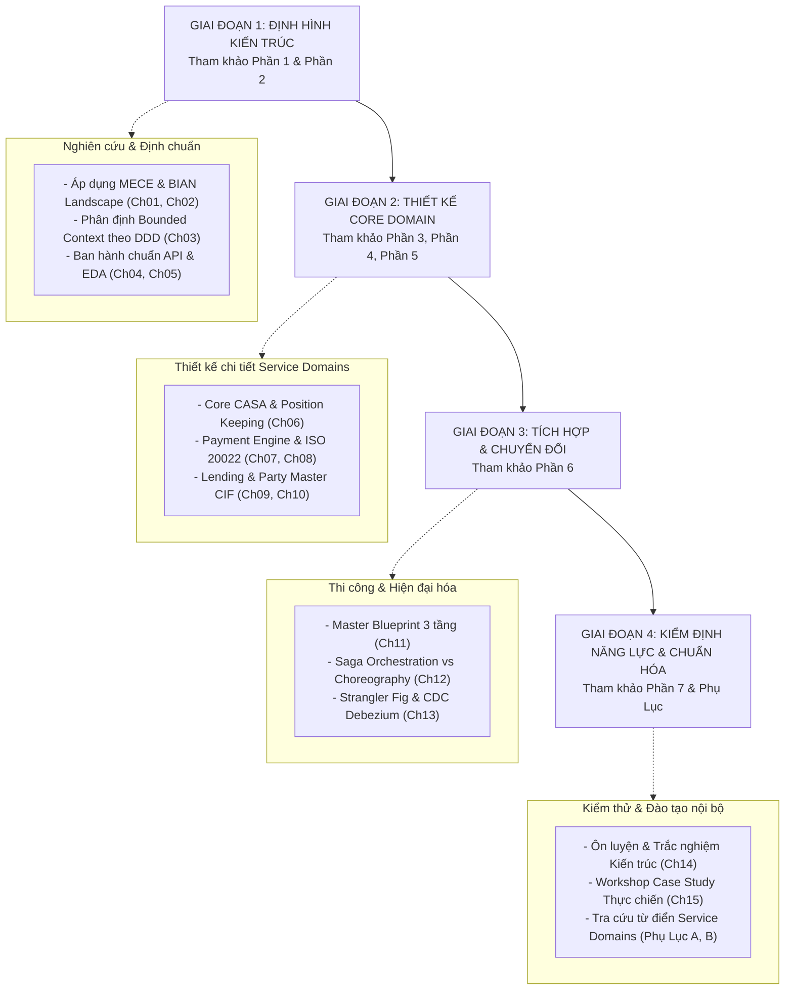

# Trang Bìa & Chuẩn Mực Thực Hành Kiến Trúc
## BIAN Microservices Architecture Handbook for Enterprise Banking Modernization

---

## THÔNG TIN XUẤT BẢN & CHUẨN MỰC THỰC HÀNH KIẾN TRÚC (ENTERPRISE ARCHITECTURE PRACTICE COLOPHON)

| Thuộc tính ấn phẩm | Thông tin chi tiết |
| :--- | :--- |
| **Tên ấn phẩm chuẩn** | **Thiết Kế Microservices Cho Ngân Hàng Thực Chiến Với BIAN** *(BIAN Microservices Architecture Handbook for Enterprise Banking Modernization)* |
| **Tác giả & Lead Architect Practice** | **Lương Đ. H.** *(Principal Banking Enterprise Architect / Lead Architecture Practice)* |
| **Đơn vị thực hành kiến trúc** | **Digital Banking Enterprise Architecture Practice** |
| **Khung tiêu chuẩn áp dụng** | BIAN Service Landscape Edition 11.0 / 12.0 • ISO 20022 • Domain-Driven Design (DDD) • Cloud-Native Enterprise Architecture |
| **Mã tài liệu chuẩn hóa** | `ARCH-PUB-BIAN-2026-V1.0` |
| **Đối tượng áp dụng** | Enterprise Architects, Solution Architects, Core Banking Modernization Squads, Lead Engineers, Business Analysts |
| **Tình trạng kiểm định** | **Approved by Enterprise Architecture Review Board (ARB)** |

---

## LỜI NÓI ĐẦU CỦA LEAD ARCHITECT PRACTICE

Trong hơn một thập kỷ tham gia tư vấn, thiết kế và thực thi chuyển đổi số cho các định chế tài chính và ngân hàng thương mại, tôi nhận thấy một sự đứt gãy lớn: **Khoảng cách giữa tiêu chuẩn kiến trúc quốc tế và thực tiễn thi công phần mềm.**

Hiệp hội **BIAN (Banking Industry Architecture Network)** đã cung cấp một bản đồ chuẩn mực tuyệt vời với hơn 300 Service Domains độc lập. Tuy nhiên, nếu thiếu một phương pháp luận chuyển hóa cụ thể, các ngân hàng thường rơi vào hai thái cực sai lầm:
1. **Lý thuyết hóa BIAN:** Xây dựng hàng nghìn trang tài liệu kiến trúc nhưng đội ngũ lập trình viên không biết viết API, thiết kế Database hay xử lý Event như thế nào cho đúng chuẩn.
2. **Microservices tự phát:** Cắt nhỏ hệ thống Core Banking theo phòng ban hoặc cắt cơ học theo từng bảng dữ liệu, dẫn đến thảm họa **"Distributed Monolith"** – độ trễ gọi chéo mạng lên tới hàng trăm mili-giây và mất nhất quán dữ liệu hạch toán tài chính.

Cuốn sách **"Thiết Kế Microservices Cho Ngân Hàng Thực Chiến Với BIAN"** ra đời như một **Khung Thực Hành Chuẩn Mực (Enterprise Architecture Practice Standard)**. Ấn phẩm này không chỉ là tài liệu lý thuyết, mà là bản vẽ thực thi chi tiết từ A đến Z giúp các Kiến trúc sư và Kỹ sư Ngân hàng:
- **Phân rã chuẩn xác** hệ thống Core Banking liền khối sang các Bounded Context hoàn hảo.
- **Thiết kế hợp đồng dữ liệu** theo BIAN Semantic API và chuẩn thông điệp ISO 20022.
- **Làm chủ kỹ thuật xử lý giao dịch tài chính phân tán:** Saga Pattern, Outbox Pattern, CQRS và Optimistic Concurrency Control dưới 15ms.
- **Dẫn dắt lộ trình chuyển đổi không gián đoạn** theo Strangler Fig Pattern kết hợp Change Data Capture (CDC).

Hy vọng cuốn sách này sẽ là tài sản tri thức hữu ích, đồng hành cùng bạn và tổ chức trên con đường kiến tạo nền tảng ngân hàng số hiện đại, bền vững và đẳng cấp thế giới.

**Lương Đ. H.**  
*Principal Banking Enterprise Architect*  
*Digital Banking Enterprise Architecture Practice*

---

## KHUNG QUẢN TRỊ & ÁP DỤNG TRONG TỔ CHỨC KIẾN TRÚC NGÂN HÀNG

Để phát huy tối đa giá trị của cuốn sách trong các dự án thực tế, **Enterprise Architecture Practice** khuyến nghị các đội ngũ dự án tuân thủ lộ trình tham chiếu 4 giai đoạn sau:

---

## MỤC LỤC TỔNG THỂ CỦA ẤN PHẨM

* [Trang Bìa & Chuẩn Mực Kiến Trúc Practice Standard](00_Trang_Bia_Va_Thong_Tin_Xuat_Ban_Practice_Standard.md)
* [Mục Lục & Hướng Dẫn Chung](index.md)
* Phần 1: Nền Tảng Kiến Trúc BIAN (BIAN Foundations)
  * [Chương 1: Tổng Quan BIAN & Kiến Trúc Ngân Hàng Hiện Đại](Part_01_BIAN_Foundations/Ch01_Tong_Quan_BIAN_Va_Service_Landscape.md)
  * [Chương 2: BIAN Metamodel – Control Record, Behavior Qualifier & BOM](Part_01_BIAN_Foundations/Ch02_Cac_Thanh_Phan_Kien_Truc_BIAN_Metamodel.md)
* Phần 2: Phương Pháp Luận Thực Chiến Step-by-Step
  * [Chương 3: Step-by-Step Mapping Từ BIAN Sang Microservices](Part_02_Step_By_Step_Methodology/Ch03_Tu_BIAN_Service_Domain_Den_Microservice_Bounded_Context.md)
  * [Chương 4: Thiết Kế API & Event-Driven Theo BIAN Semantic API](Part_02_Step_By_Step_Methodology/Ch04_Thiet_Ke_API_Va_Event_Driven_Theo_BIAN_Semantic_API.md)
  * [Chương 5: Chiến Lược Quản Trị Dữ Liệu Phân Tán (CQRS & Saga)](Part_02_Step_By_Step_Methodology/Ch05_Chien_Luoc_Du_Lieu_Polyglot_Va_CQRS_Saga.md)
* Phần 3: Core Banking – CASA Domain
  * [Chương 6: Thiết Kế Microservices CASA (Current Account & Savings Account)](Part_03_Core_Banking_CASA_Domain/Ch06_Thiet_Ke_Microservices_Current_Account_Va_Savings_Account.md)
* Phần 4: Payments & ISO 20022 Domain
  * [Chương 7: Thiết Kế Payment Engine & Payment Execution](Part_04_Payments_Va_ISO20022_Domain/Ch07_Thiet_Ke_Payment_Engine_Va_Payment_Execution.md)
  * [Chương 8: Chuẩn Hóa Giao Tiếp ISO 20022 & Payment Order Microservice](Part_04_Payments_Va_ISO20022_Domain/Ch08_Giao_Tiep_ISO20022_Va_Payment_Order_Microservice.md)
* Phần 5: Lending & Customer Management Domain
  * [Chương 9: Thiết Kế Hệ Thống Tín Dụng (Loan Origination & Servicing)](Part_05_Lending_Va_Customer_Management_Domain/Ch09_Thiet_Ke_He_Thong_Vay_Loan_Origination_Va_Servicing.md)
  * [Chương 10: Quản Trị Khách Hàng Định Danh Duy Nhất (Party Management & KYC)](Part_05_Lending_Va_Customer_Management_Domain/Ch10_Party_Management_Customer_Profile_Va_KYC.md)
* Phần 6: Master Banking Blueprint & Lộ Trình Hiện Đại Hóa
  * [Chương 11: Tổng Thể Master Banking Microservices Blueprint](Part_06_Master_Banking_Blueprint/Ch11_Tong_The_Banking_Microservices_Blueprint.md)
  * [Chương 12: Integration Architecture (Choreography vs Orchestration & Event Mesh)](Part_06_Master_Banking_Blueprint/Ch12_Integration_Architecture_Choreography_vs_Orchestration.md)
  * [Chương 13: Lộ Trình Chuyển Đổi Core Banking (Strangler Fig Pattern)](Part_06_Master_Banking_Blueprint/Ch13_Lo_Trinh_Chuyen_Doi_Core_Banking_Strangler_Fig_Pattern.md)
* Phần 7: Bài Tập Thực Hành, Trắc Nghiệm & Case Study Tổng Hợp
  * [Chương 14: Hệ Thống Câu Hỏi Trắc Nghiệm Ôn Tập & Đánh Giá Năng Lực Kiến Trúc](Part_07_Exercises_Quizzes_And_Case_Studies/Ch14_He_Thong_Cau_Hoi_Trac_Nghiem_On_Tap_13_Chuong.md)
  * [Chương 15: Bài Tập Thực Chiến Thiết Kế Kiến Trúc & Case Study Tổng Hợp](Part_07_Exercises_Quizzes_And_Case_Studies/Ch15_Bai_Tap_Thuc_Chien_Thiet_Ke_Kien_Truc_Va_Case_Studies.md)

---
*Bản quyền ấn phẩm thuộc về **Digital Banking Enterprise Architecture Practice (Lead Architect: Lương Đ. H.)**.*
