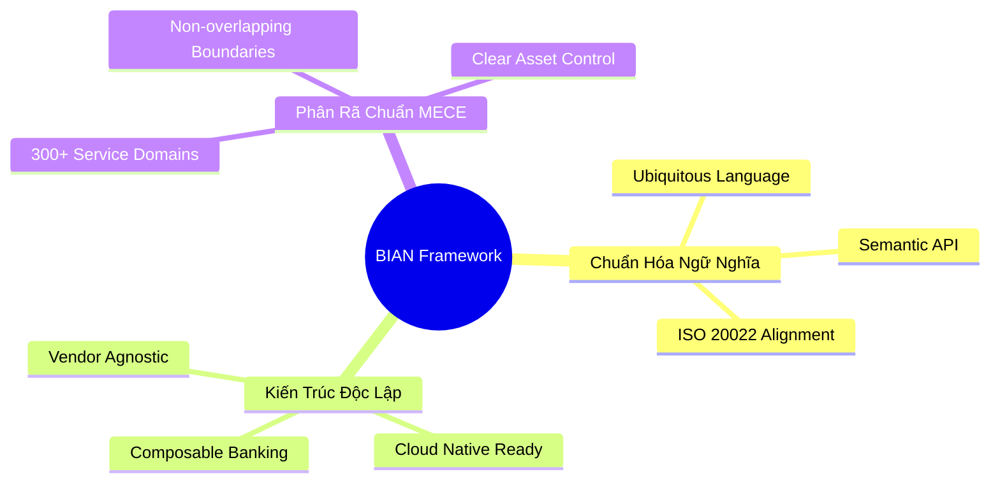
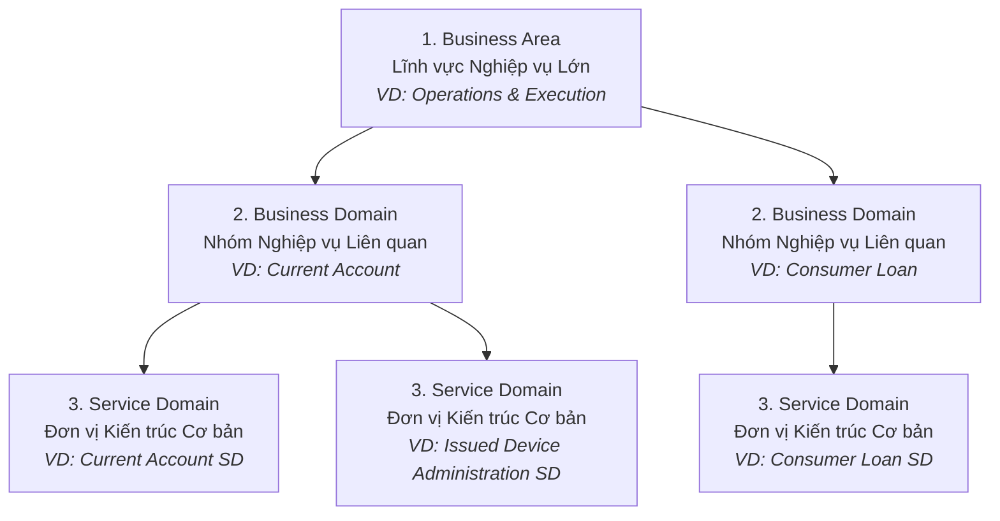

# Chương 1: Tổng Quan BIAN & Kiến Trúc Ngân Hàng Hiện Đại (Service Landscape)

---

## 1.1 Khủng Hoảng Kiến Trúc Trong Các Dự Án Chuyển Đổi Core Banking

Trong nhiều thập kỷ, các ngân hàng vận hành trên những hệ thống **Core Banking liền khối (Monolithic Core Banking)** như AS400, mainframe COBOL, hay các gói phần mềm liền khối đời đầu. Khi bước vào kỷ nguyên Ngân hàng Số (Digital Banking), các hệ thống này lộ rõ tử huyệt:
- **Thời gian đưa ra thị trường (Time-to-Market) cực chậm:** Việc ra mắt một sản phẩm tiết kiệm hoặc khoản vay mới mất từ 6 đến 12 tháng.
- **Rủi ro ảnh hưởng dây chuyền (Blast Radius cao):** Sửa một lỗi nhỏ trong phân hệ tính lãi có thể làm sập toàn bộ cổng thanh toán thẻ.
- **Khó khăn mở rộng quy mô (Vertical Scaling Cost):** Chi phí nâng cấp phần cứng Mainframe tăng theo cấp số nhân khi tải giao dịch tăng cao vào các dịp cao điểm.

Để giải quyết bài toán này, các ngân hàng đồng loạt hướng đến **Kiến trúc Vi dịch vụ (Microservices Architecture)**. Tuy nhiên, một thực tế đáng báo động là hơn 70% các chương trình "Microservices Hóa" tại ngân hàng sa lầy vào mô hình **Distributed Monolith (Khối liền khối phân tán)**.

### Nguyên nhân thất bại điển hình: Bẫy Conway's Law & Phân chia theo phòng ban
Định luật Conway chỉ ra rằng: *"Cấu trúc kiến trúc hệ thống phản ánh chính cơ cấu tổ chức giao tiếp của doanh nghiệp đó"*. 
Các ngân hàng truyền thống thường chia Microservices theo sơ đồ tổ chức phòng ban:
- Service Khách Hàng Cá Nhân (Retail Banking Service)
- Service Khách Hàng Doanh Nghiệp (Corporate Banking Service)
- Service Thẻ (Card Department Service)
- Service Quản Trị Rủi Ro (Risk Department Service)

Hệ quả là: Khi một khách hàng cá nhân muốn mở tài khoản thẻ tín dụng, hệ thống phải thực hiện hàng chục lệnh gọi đồng bộ (Synchronous REST calls) đan chéo giữa các service trên, dẫn đến:
1. **Dư thừa dữ liệu (Data Duplication):** Service nào cũng lưu thông tin khách hàng, số dư, và trạng thái hợp đồng theo cách riêng.
2. **Độ trễ gia tăng (Latency Amplification):** Chuỗi gọi API dài dằng dặc (API Chaining) khiến độ trễ một giao dịch lên tới vài giây.
3. **Mất tính độc lập triển khai:** Không thể deploy service Thẻ nếu service Khách Hàng Cá Nhân chưa cập nhật contract.

---

## 1.2 BIAN Là Gì? Vì Sao Ngân Hàng Cần BIAN?

**BIAN (Banking Industry Architecture Network)** là một tổ chức phi lợi nhuận toàn cầu ra đời năm 2008, quy tụ hàng trăm ngân hàng hàng đầu (JPMorgan Chase, ING, PNC, ANZ...) và các hãng công nghệ lớn (IBM, Microsoft, SAP...).

BIAN ra đời nhằm cung cấp một **Bộ khung Kiến trúc Chuẩn mực (Standard Banking Architecture Framework)** độc lập với nhà cung cấp phần mềm, giúp các ngân hàng:
- Chuẩn hóa ngữ nghĩa nghiệp vụ (**Ubiquitous Language** trong Domain-Driven Design).
- Xác định ranh giới rõ ràng cho các năng lực nghiệp vụ (**Business Capabilities**).
- Tạo ra bản đồ dịch vụ chuẩn (**Service Landscape**) để chia nhỏ ngân hàng thành các khối xây dựng độc lập (**Standardized Building Blocks**).

---

## 1.3 Cấu Trúc BIAN Service Landscape

BIAN Service Landscape là bản đồ toàn cảnh của một ngân hàng, chia nhỏ ngân hàng thành một cấu trúc phân cấp 3 tầng rõ ràng: **Business Area -> Business Domain -> Service Domain**.

### 1. Business Area (Lĩnh vực Nghiệp vụ)
Là cấp độ cao nhất, phân chia ngân hàng thành các khu vực quản trị chiến lược và vận hành. Trong BIAN v11/v12, có các Business Areas tiêu biểu như:
- **Reference Data & Models:** Quản lý dữ liệu tham chiếu, danh mục, tỷ giá, sản phẩm.
- **Sales & Service:** Các kênh tiếp xúc khách hàng, marketing, chăm sóc khách hàng.
- **Operations & Execution:** Xử lý nghiệp vụ lõi (Tài khoản, Tín dụng, Thanh toán, Nguồn vốn).
- **Risk & Compliance:** Quản lý rủi ro tín dụng, AML, KYC, tuân thủ pháp lý.

### 2. Business Domain (Miền Nghiệp vụ)
Là nhóm các năng lực nghiệp vụ có sự tương đồng lớn về mục tiêu. Ví dụ: Trong Business Area *Operations & Execution*, có các Business Domain như *Current Account*, *Payments*, *Lending*.

### 3. Service Domain (Miền Dịch vụ - Đơn vị Cốt lõi của BIAN)
**Service Domain (SD)** là khối xây dựng cơ bản (Elementary Building Block) của BIAN. Một Service Domain đại diện cho **một và chỉ một năng lực nghiệp vụ duy nhất** của ngân hàng.
- Hiện nay BIAN Service Landscape định nghĩa khoảng **300+ Service Domains**.
- Mỗi Service Domain chịu trách nhiệm quản lý trọn vẹn vòng đời của một tài sản nghiệp vụ (**Asset/Control Record**).

---

## 1.4 Nguyên Tắc Vàng MECE Trong BIAN

Nguyên lý cốt lõi khiến BIAN trở thành nền tảng hoàn hảo để thiết kế Microservices là nguyên tắc **MECE (Mutually Exclusive, Collectively Exhaustive)**:

> **Mutually Exclusive (Độc lập lẫn nhau - Không trùng lặp):**
> Không có bất kỳ 2 Service Domain nào thực hiện chung một logic nghiệp vụ hoặc sở hữu chung một tập dữ liệu gốc (System of Record).

> **Collectively Exhaustive (Tổng hợp đầy đủ - Không bỏ sót):**
> Khi tập hợp toàn bộ 300+ Service Domains của BIAN lại, chúng bao phủ 100% mọi hoạt động nghiệp vụ diễn ra trong một ngân hàng thương mại hiện đại.

### So sánh cách chia BIAN MECE vs Cách chia truyền thống

| Tiêu chí | Phân chia truyền thống (Phòng ban/Sản phẩm) | Phân chia theo BIAN Service Domain (MECE) |
| :--- | :--- | :--- |
| **Quản lý Thông tin Khách hàng** | Nằm rải rác ở App Mobile, Core Banking CASA, Hệ thống Vay, Hệ thống Thẻ. | Tập trung duy nhất tại **Party Routing SD** và **Customer Profile SD**. |
| **Tính Phí & Lãi suất** | Mỗi module tự viết công thức tính phí/lãi riêng, dễ sai lệch logic. | Tập trung logic biểu phí tại **Fee Handling SD** và lãi suất tại **Interest Calculation SD**. |
| **Khả năng tái sử dụng (Reusability)** | Thấp, code bị sao chép (Copy-Paste Engineering). | Cao, các SD hoạt động như API Service chuẩn hóa có thể gọi từ bất kỳ kênh nào. |

---

## 1.5 Tóm Tắt Chương 1

- Kiến trúc Microservices ngân hàng sẽ thất bại nếu ranh giới dịch vụ được vẽ theo sơ đồ tổ chức phòng ban thay vì năng lực nghiệp vụ.
- BIAN Service Landscape cung cấp bản đồ kiến trúc ngân hàng chuẩn toàn cầu chia theo 3 cấp: **Business Area -> Business Domain -> Service Domain**.
- Nguyên tắc **MECE** đảm bảo mỗi Service Domain sở hữu độc quyền logic và trạng thái của một tài sản nghiệp vụ, tạo tiền đề vững chắc cho ranh giới **Bounded Context** trong Domain-Driven Design.
