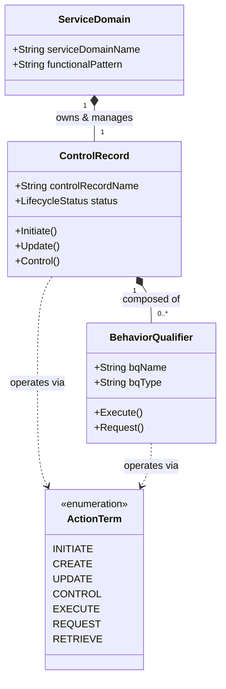
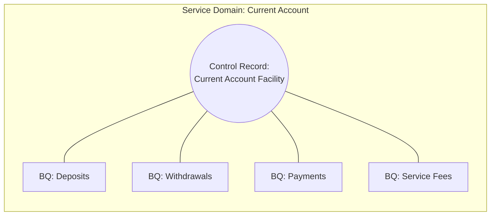
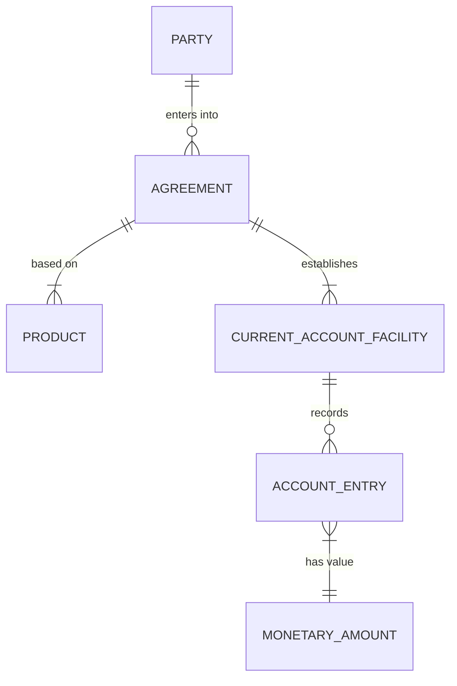

# Chương 2: BIAN Metamodel – Control Record, Behavior Qualifier & BOM

---

## 2.1 Cấu Trúc Giải Phẫu Một BIAN Service Domain (Anatomy of a Service Domain)

Để áp dụng BIAN vào việc thiết kế Microservices, kiến trúc sư không chỉ nhìn Service Domain như một "chiếc hộp đen" mang tên nghiệp vụ, mà phải thấu hiểu siêu mô hình ("BIAN Metamodel") bên trong nó.

Mỗi BIAN Service Domain được xây dựng xoay quanh 3 thành phần cốt lõi:

1. "Control Record (CR):" Tài sản nghiệp vụ trung tâm mà Service Domain chịu trách nhiệm quản lý trọn vẹn vòng đời.
2. "Behavior Qualifiers (BQ):" Các phân hệ/chức năng hành vi bổ trợ gắn liền với Control Record.
3. "Action Terms:" Các động từ thao tác chuẩn hóa được thực thi trên Control Record hoặc Behavior Qualifier.



---

## 2.2 Control Record (CR) – Trái Tim Của Service Domain

"Control Record (Bản ghi Kiểm soát)" đại diện cho trạng thái nghiệp vụ, hợp đồng, hoặc tài sản thực thể duy nhất mà Service Domain sở hữu độc quyền (System of Record).

### Ví dụ về Control Record trong Ngân hàng thực tế:
- Trong "Current Account SD", Control Record là `Current Account Facility` (Hợp đồng/Tài khoản thanh toán).
- Trong "Payment Order SD", Control Record là `Payment Order` (Lệnh thanh toán).
- Trong "Consumer Loan SD", Control Record là `Consumer Loan Facility` (Hợp đồng tín dụng tiêu dùng).

> [!IMPORTANT]
> "Nguyên tắc Thiết kế Microservice từ Control Record:"
> Khi thiết kế Database cho Microservice, "Control Record chính là Aggregate Root" trong Domain-Driven Design (DDD). Mọi thao tác thay đổi trạng thái của Aggregate Root này bắt buộc phải đi qua API/Service Domain sở hữu nó, tuyệt đối không cho phép các Service khác truy cập trực tiếp vào Database (No Shared Database).

---

## 2.3 Behavior Qualifiers (BQ) – Chi Tiết Hành Vi Nghiệp Vụ

Một Control Record thường có nhiều khía cạnh hoạt động chi tiết. BIAN sử dụng "Behavior Qualifiers (BQ)" để phân chia logic bên trong Control Record thành các cụm chức năng nhỏ hơn.

### Ví dụ bên trong `Current Account Facility` (Control Record):
- "Deposits (BQ):" Xử lý các nghiệp vụ nộp tiền, ghi có vào tài khoản.
- "Withdrawals (BQ):" Xử lý các nghiệp vụ rút tiền, chuyển khoản đi, ghi nợ.
- "Service Fees (BQ):" Theo dõi lịch sử và cấu hình thu phí duy trì tài khoản.
- "Issued Device (BQ):" Liên kết thẻ ghi nợ (Debit Card) hoặc token bảo mật phát hành cho tài khoản.



---

## 2.4 BIAN Action Terms – 7 Thao Tác Chuẩn Hóa API

BIAN định nghĩa nghiêm ngặt "7 Action Terms" để chuẩn hóa ý nghĩa các hành động trên Service Domain. Điều này giúp loại bỏ tình trạng mỗi lập trình viên đặt tên endpoint REST API theo ý thích cá nhân (như `/doTransfer`, `/makePayment`, `/createAccountNow`).

| Action Term | Ý nghĩa Nghiệp vụ | Mapping sang HTTP/REST Verb | Mục đích & Ngữ cảnh sử dụng |
| :--- | :--- | :--- | :--- |
| "Initiate" | Khởi tạo một Control Record mới lần đầu tiên | `POST` | Mở tài khoản mới, khởi tạo hồ sơ vay mới, tạo lệnh thanh toán. |
| "Create" | Tạo mới một thực thể con (BQ) bên trong CR đã có | `POST` | Thêm người đồng sở hữu tài khoản, phát hành thêm thẻ cho tài khoản hiện hữu. |
| "Update" | Cập nhật thông tin thuộc tính của CR hoặc BQ | `PUT / PATCH` | Đổi hạn mức giao dịch tài khoản, cập nhật địa chỉ gửi sao kê. |
| "Control" | Thay đổi trạng thái vòng đời (Lifecycle State) của CR | `PUT` | Khóa tài khoản tạm thời (Freeze), phong tỏa tài khoản, đóng tài khoản. |
| "Execute" | Thực thi một giao dịch nghiệp vụ tự động/tức thời | `POST` | Thực hiện hạch toán ghi nợ/ghi có ngay lập tức vào số dư. |
| "Request" | Yêu cầu một quy trình xử lý có sự can thiệp hoặc xét duyệt | `POST` | Yêu cầu cấp hạn mức thấu chi (cần thẩm định phê duyệt). |
| "Retrieve" | Truy vấn thông tin, trạng thái, lịch sử của CR hoặc BQ | `GET` | Xem số dư hiện tại, lấy sao kê giao dịch trong tháng. |

### Minh họa cấu trúc URL REST API theo chuẩn BIAN Semantic API:
```http
POST   /api/v1/current-account/sd-current-account/current-account-facilities/initiate
POST   /api/v1/current-account/sd-current-account/current-account-facilities/{cr-id}/deposits/execute
GET    /api/v1/current-account/sd-current-account/current-account-facilities/{cr-id}/retrieve
PUT    /api/v1/current-account/sd-current-account/current-account-facilities/{cr-id}/control
```

---

## 2.5 Business Object Model (BOM) & Sự Đồng Bộ Với ISO 20022

Một điểm yếu chết người khi thiết kế Microservices là phân mảnh mô hình dữ liệu. Service A gọi thuộc tính khách hàng là `client_id`, Service B gọi là `customerNumber`, Service C gọi là `partyId`.

BIAN giải quyết triệt để vấn đề này bằng "Business Object Model (BOM)":

- BOM là sơ đồ lớp dữ liệu tổng thể (Enterprise Class Diagram) chuẩn hóa toàn bộ các thực thể thông tin trong ngân hàng: `Party`, `Agreement`, `Product`, `Account`, `Transaction`, `Position`.
- BIAN BOM được ánh xạ trực tiếp và tương thích sâu sắc với chuẩn thông điệp tài chính quốc tế "ISO 20022".



### Lợi ích khi sử dụng BIAN BOM trong thiết kế DTO / Event Payload:
1. "Khả năng tương tác (Interoperability):" Các Microservices giao tiếp nội bộ bằng JSON Schema dẫn xuất từ BOM, dễ dàng chuyển tiếp ra bên ngoài qua cổng thanh toán ISO 20022 (pacs.008, pain.001).
2. "Giảm thiểu Anti-Corruption Layer (ACL):" Vì tất cả Microservices nội bộ cùng nói chung một ngôn ngữ BOM, ngân hàng giảm thiểu được chi phí viết các lớp chuyển đổi dữ liệu (Data Transformer) cồng kềnh.

---

## 2.6 Tóm Tắt Chương 2

- "Control Record" là Aggregate Root của Service Domain, xác định chủ quyền dữ liệu duy nhất.
- "Behavior Qualifiers" chia nhỏ chức năng bên trong Control Record thành các cụm nghiệp vụ độc lập.
- "7 Action Terms" (*Initiate, Create, Update, Control, Execute, Request, Retrieve*) chuẩn hóa hợp đồng API (REST/gRPC verbs).
- "BIAN BOM" chuẩn hóa từ vựng dữ liệu ngân hàng, tạo cầu nối liền mạch với tiêu chuẩn "ISO 20022".
