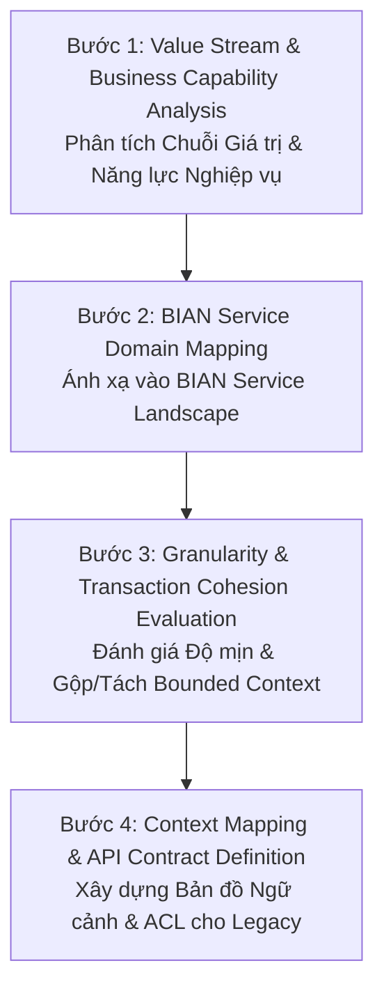
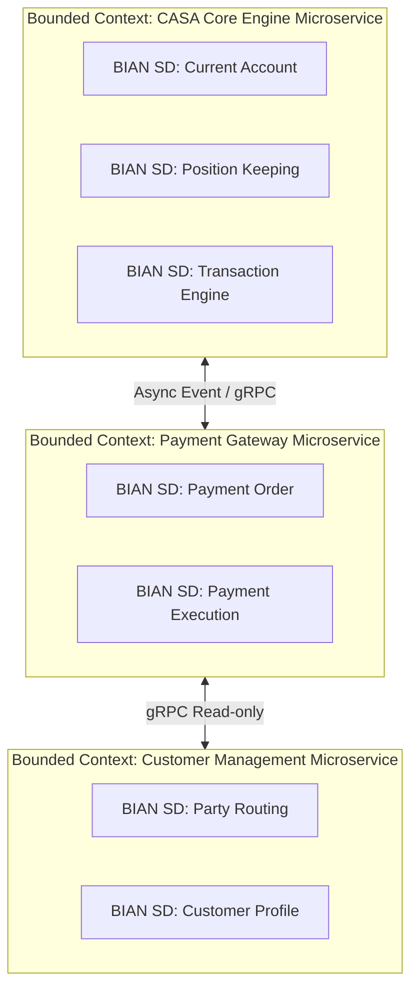
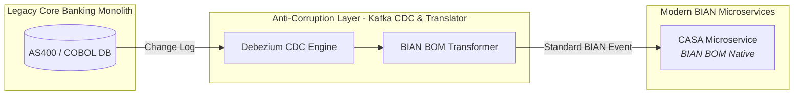

# Chương 3: Step-by-Step Mapping Từ BIAN Sang Microservices (DDD & Bounded Context)

---

## 3.1 Khung Phương Pháp Luận Thực Chiến 4 Bước (4-Step Pragmatic Mapping Framework)

Một trong những sai lầm phổ biến nhất khi ứng dụng BIAN là coi "300+ Service Domains" như một danh sách 300+ Microservices cần phải viết code độc lập. Nếu triển khai mù quáng "1 Service Domain = 1 Microservice deploy độc lập", ngân hàng sẽ phải đối mặt với thảm họa vận hành hàng trăm container nhỏ xíu gọi nhau chằng chịt, khiến latency bùng nổ và quản trị giao dịch ACID trở thành bất khả thi.

Để chuyển đổi thành công từ BIAN sang "Domain-Driven Design (DDD) Bounded Contexts" thực tế, kiến trúc sư cần tuân thủ "Quy trình 4 Bước Chuẩn Hóa":

---

## 3.2 Bước 1: Phân Tích Chuỗi Giá Trị & Năng Lực Nghiệp Vụ (Value Stream Analysis)

Trước khi viết bất kỳ dòng code hay vẽ sơ đồ Microservice nào, bước đầu tiên là phải vẽ được "Chuỗi giá trị nghiệp vụ đầu-cuối (End-to-End Value Stream)" của ngân hàng.

### Ví dụ: Chuỗi Giá trị "Mở Tài Khoản Thanh Toán & Thẻ Cho Khách Hàng Mới (Digital Onboarding & Account Opening)"
1. Khách hàng thực hiện eKYC trên ứng dụng Mobile Banking.
2. Ngân hàng kiểm tra danh tính và tạo hồ sơ khách hàng duy nhất (CIF / Customer Identification Number).
3. Khởi tạo tài khoản thanh toán CASA (Current Account) cho khách hàng.
4. Phát hành thẻ ghi nợ phi vật lý (Virtual Debit Card) gắn liền với tài khoản CASA.

---

## 3.3 Bước 2: Ánh Xạ Vào BIAN Service Landscape (Service Domain Mapping)

Từ chuỗi giá trị ở Bước 1, chúng ta đối chiếu từng bước với "BIAN Service Landscape v11/v12" để xác định các Service Domain tham gia vào hành trình.

| Bước trong Chuỗi Giá Trị | Năng lực Nghiệp vụ | BIAN Service Domain Tương Ứng | Control Record |
| :--- | :--- | :--- | :--- |
| "1. eKYC & Kiểm tra danh tính" | Định danh & kiểm tra rủi ro tuân thủ | `Customer Case Management SD` & `Regulatory Compliance SD` | Customer Compliance Case |
| "2. Tạo Hồ Sơ Khách Hàng" | Lưu trữ hồ sơ định danh chính thức | `Party Routing SD` & `Customer Profile SD` | Party Reference / Customer Profile |
| "3. Mở Tài Khoản CASA" | Khởi tạo hợp đồng tài khoản thanh toán | `Current Account SD` | Current Account Facility |
| "4. Phát Hành Thẻ" | Cung cấp thẻ ghi nợ liên kết tài khoản | `Issued Device Administration SD` | Issued Device |

---

## 3.4 Bước 3: Đánh Giá Độ Mịn & Gộp/Tách Bounded Context (Granularity & Cohesion Evaluation)

Đây là bước quan trọng nhất quyết định sự thành bại của kiến trúc. Chúng ta sử dụng 3 tiêu chí kỹ thuật để quyết định "Khi nào giữ 1 Service Domain là 1 Microservice độc lập", và "Khi nào gộp nhiều Service Domain thành một Bounded Context chung":

### 1. Transactional Cohesion (Độ gắn kết Giao dịch ACID)
Nếu hai Service Domain liên tục phải cập nhật dữ liệu trong cùng một giao dịch kinh doanh với yêu cầu độ trễ dưới 10ms và độ nhất quán tuyệt đối (ACID), hãy "GỘP (Merge)" chúng vào cùng một Microservice Bounded Context.

> *Ví dụ:* `Current Account SD` (quản lý hợp đồng tài khoản) và `Position Keeping SD` (quản lý số dư tức thời) thường xuyên hạch toán đồng thời trong một giao dịch thanh toán. Do đó, trong thực tế kiến trúc Core Banking mới, hai Service Domain này thường được gộp vào chung Bounded Context mang tên "Account & Balance Management Microservice".

### 2. Independent Scalability & Lifecycle (Khả năng Mở rộng & Phát triển Độc lập)
Nếu hai Service Domain có tốc độ thay đổi nghiệp vụ (Change Rate) hoặc tải lưu lượng (TPS) chênh lệch hàng trăm lần, hãy "TÁCH (Separate)" chúng thành các Microservices riêng biệt.

> *Ví dụ:* `Customer Profile SD` (ít thay đổi, chủ yếu đọc GET) và `Payment Execution SD` (lưu lượng TPS cực cao, xử lý thanh toán liên tục 24/7) bắt buộc phải tách thành 2 Microservices độc lập để scale container linh hoạt trên Kubernetes.

### 3. Conway's Law & Team Ownership
Mỗi Microservice Bounded Context nên có kích thước vừa đủ để "một đội Two-Pizza Team (6-8 kỹ sư)" sở hữu trọn vẹn từ Database, Logic đến Deployment.

---

## 3.5 Bước 4: Context Mapping & Anti-Corruption Layer (ACL)

Trong môi trường thực tế, ngân hàng không bao giờ xây dựng mới 100% từ đầu (Greenfield) mà luôn phải kết nối với Core Banking truyền thống (Mainframe / AS400).

Sử dụng sơ đồ "DDD Context Map", chúng ta thiết lập ranh giới giao tiếp:

- "Upstream / Downstream Relationship:" Các Microservice BIAN đóng vai trò hiện đại hóa (Downstream) nhận sự kiện hoặc truy vấn từ Core cũ (Upstream).
- "Anti-Corruption Layer (Lớp Chống Suy Thoái - ACL):" Một lớp dịch thuật đứng ở vùng đệm, chuyển đổi dữ liệu thô kệch, định danh lạ lẫm của Core Banking cũ sang chuẩn "BIAN BOM / ISO 20022 JSON Schema" trước khi đưa vào Microservices mới.

---

## 3.6 Tóm Tắt Chương 3

- Sử dụng "Quy trình 4 bước" để chuyển hóa BIAN từ lý thuyết sang kiến trúc Microservice thực dụng.
- "Không phải 1 BIAN Service Domain nào cũng là 1 Microservice riêng biệt". Cần gom nhóm theo "Transactional Cohesion (Độ gắn kết giao dịch)" và "Independent Scalability (Khả năng mở rộng)".
- Xây dựng "Anti-Corruption Layer (ACL)" để cô lập dữ liệu Core Banking cũ, giữ cho các Microservices BIAN luôn sạch sẽ theo chuẩn BOM toàn cầu.
