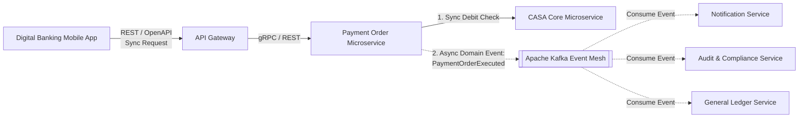

# Chương 4: Thiết Kế API & Event-Driven Theo BIAN Semantic API

---

## 4.1 Kiến Trúc Giao Tiếp Trong BIAN Microservices: Synchronous vs Asynchronous

Một kiến trúc Microservices ngân hàng bền vững không phụ thuộc hoàn toàn vào các lời gọi REST API đồng bộ (Synchronous), bởi vì mỗi lời gọi mạng nối tiếp (HTTP Hop) đều cộng dồn độ trễ và làm tăng nguy cơ lỗi dây chuyền (Cascading Failure).

BIAN định hướng phân chia giao tiếp hệ thống thành 2 mô hình rõ rệt:

1. "Synchronous Request-Reply (REST / gRPC):" Sử dụng cho các thao tác yêu cầu kết quả tức thì như kiểm tra số dư khả dụng (Balance Check), xác thực khách hàng (Authentication), hoặc khởi tạo lệnh hạch toán tức thời.
2. "Asynchronous Event-Driven Architecture (EDA với Kafka / RabbitMQ):" Sử dụng cho việc đồng bộ trạng thái giữa các Bounded Contexts, phát thông báo biến động số dư, gửi email/SMS, và kích hoạt các quy trình xử lý luồng sau (Post-processing workflows).



---

## 4.2 Đặc Tả BIAN Semantic API (OpenAPI Standard)

BIAN Semantic API quy định chuẩn cấu trúc URI, HTTP Headers, Error Codes và JSON Body dựa trên "Action Terms" và "Control Record".

### Nguyên tắc chuẩn hóa URI BIAN:
```http
{protocol}://{domain-host}/api/v{version}/{business-domain}/{service-domain}/{control-record-collection}/{cr-id}/{behavior-qualifier-collection}/{bq-id}/{action-term}
```

### Ví dụ OpenAPI 3.0 Specification chuẩn BIAN cho `Current Account SD`:
Dưới đây là mẫu đặc tả OpenAPI minh họa endpoint khởi tạo lệnh nộp tiền (Deposit Execution) vào tài khoản CASA:

```yaml
openapi: 3.0.3
info:
  title: BIAN Semantic API - Current Account Service Domain
  version: 12.0.0
  description: Specialised BIAN Semantic API for managing Current Account Facilities.
paths:
  /api/v1/current-account/sd-current-account/current-account-facilities/{crId}/deposits/execute:
    post:
      summary: Execute a deposit transaction on a Current Account Facility
      operationId: executeDeposit
      parameters:
        - name: crId
          in: path
          required: true
          description: Unique identifier of the Current Account Control Record
          schema:
            type: string
            example: "CA-8839201-VN"
        - name: X-Idempotency-Key
          in: header
          required: true
          description: Unique UUID to prevent double-spending / duplicate execution
          schema:
            type: string
            format: uuid
      requestBody:
        required: true
        content:
          application/json:
            schema:
              $ref: '#/components/schemas/DepositExecutionRequest'
      responses:
        '200':
          description: Deposit executed successfully
          content:
            application/json:
              schema:
                $ref: '#/components/schemas/DepositExecutionResponse'
        '409':
          description: Duplicate idempotency key detected
        '422':
          description: Unprocessable entity (e.g. Account Frozen)
components:
  schemas:
    DepositExecutionRequest:
      type: object
      required:
        - transactionAmount
        - valueDate
        - bookingCurrency
      properties:
        transactionAmount:
          type: number
          format: double
          example: 5000000.00
        bookingCurrency:
          type: string
          example: "VND"
        valueDate:
          type: string
          format: date-time
          example: "2026-07-10T10:30:00Z"
        transactionReference:
          type: string
          example: "TXN-DEP-20260710-991"
    DepositExecutionResponse:
      type: object
      properties:
        accountEntryId:
          type: string
          example: "ENTRY-55412"
        updatedAvailableBalance:
          type: number
          example: 125000000.00
        executionStatus:
          type: string
          example: "CLEARED"
```

---

## 4.3 Chuẩn Hóa Event-Driven Với CloudEvents & BIAN BOM

Trong kiến trúc Hướng sự kiện (Event-Driven Architecture), nếu mỗi Microservice tự định nghĩa một cấu trúc JSON sự kiện khác nhau, toàn bộ Kafka Cluster sẽ biến thành một "bãi rác dữ liệu không thể kiểm soát".

Để chuẩn hóa, ngân hàng sử dụng tiêu chuẩn vỏ bọc "CloudEvents CNCF" kết hợp với phần thân dữ liệu ("Data Payload") tuân theo "BIAN BOM / ISO 20022".

### Cấu trúc một BIAN CloudEvent chuẩn (Ví dụ: Sự kiện hoàn tất lệnh thanh toán):

```json
{
  "specversion": "1.0",
  "id": "evt-uuid-4910-bb12-99812",
  "source": "//banking.enterprise/payments/payment-execution-service",
  "type": "org.bian.paymentexecution.v12.PaymentOrderExecuted",
  "time": "2026-07-10T10:31:15.120Z",
  "datacontenttype": "application/json",
  "subject": "PAY-ORDER-99281-VN",
  "data": {
    "controlRecordId": "PAY-ORDER-99281-VN",
    "debtorAccount": {
      "accountNumber": "190012345678",
      "currency": "VND"
    },
    "creditorAccount": {
      "accountNumber": "0071000889911",
      "bankBic": "BFTVVNVX"
    },
    "instructedAmount": {
      "amount": 15000000.00,
      "currency": "VND"
    },
    "iso20022Reference": "PACS.008.001.08",
    "executionTimestamp": "2026-07-10T10:31:15.000Z",
    "settlementStatus": "SETTLED"
  }
}
```

---

## 4.4 Các Mô Hình Thiết Kế Event Trọng Yếu Trong Ngân Hàng

### 1. Domain Events vs Integration Events
- "Domain Event (Sự kiện Miền nội bộ):" Diễn ra bên trong một Bounded Context. Ví dụ: `BalanceReservedEvent` bên trong CASA Microservice.
- "Integration Event (Sự kiện Tích hợp liên miền):" Phát ra Kafka Event Mesh để các Bounded Context khác tiêu thụ. Ví dụ: `CurrentAccountStatusChangedToFrozen` được phát cho toàn bộ hệ thống biết để từ chối giao dịch thẻ.

### 2. Event Carried State Transfer (ECST) vs Event Notification
Trong ngân hàng, để giảm tải cho Database Core khi các Service khác cần xem dữ liệu, chúng ta ưu tiên mô hình "Event Carried State Transfer (ECST)":

- Sự kiện chứa đầy đủ dữ liệu thay đổi của thực thể (`data payload` chi tiết).
- Các Service downstream (như Service Chăm sóc Khách hàng CRM hoặc Data Lake) nhận event và tự xây dựng bản sao dữ liệu chỉ đọc (Read Model - CQRS) của riêng mình, không cần gọi ngược lại `GET API` của Core Banking.

---

## 4.5 Tóm Tắt Chương 4

- Sử dụng "BIAN Semantic API (OpenAPI 3.0)" với URI tuân thủ nghiêm ngặt 7 Action Terms để chuẩn hóa hợp đồng giao tiếp REST/gRPC.
- Luôn áp dụng "X-Idempotency-Key" trong mọi API giao dịch tài chính để chống thanh toán trùng lặp (Double Spending).
- Sử dụng chuẩn "CloudEvents 1.0" bao bọc payload "BIAN BOM / ISO 20022" trong Apache Kafka để đảm bảo tính nhất quán và khả năng truy vết (Auditability) trên toàn hệ thống.
