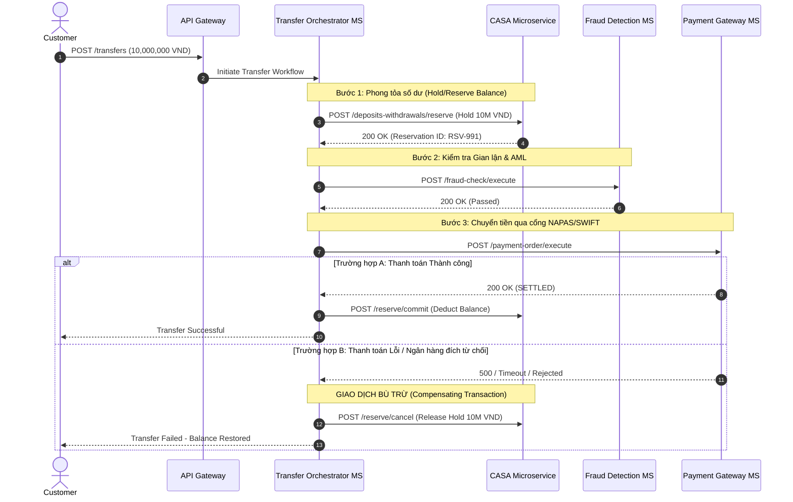
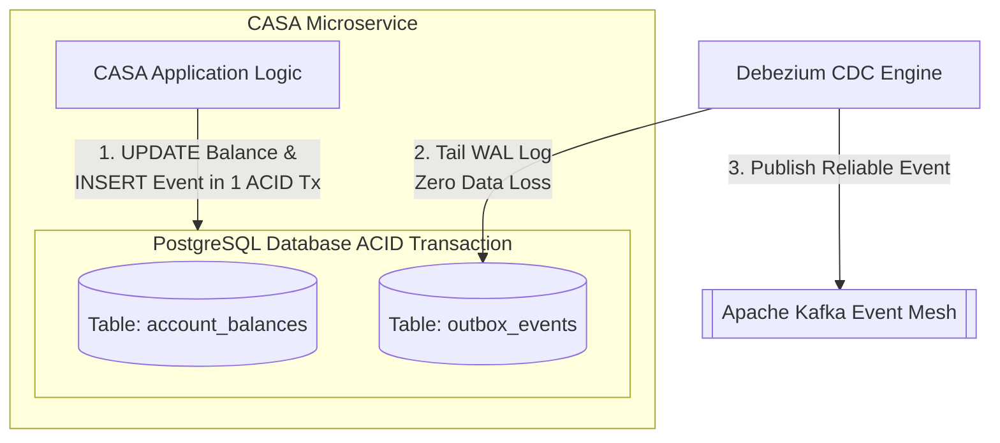

# Chương 5: Chiến Lược Quản Trị Dữ Liệu Phân Tán (Polyglot, CQRS, Saga Pattern)

---

## 5.1 Bài Toán Database-per-Service Trong Ngân Hàng & Thách Thức ACID

Khi chuyển dịch từ Monolith sang Microservices, nguyên tắc vàng là "Database-per-Service (Mỗi Microservice sở hữu cơ sở dữ liệu riêng biệt)" để đảm bảo tính độc lập triển khai và cô lập lỗi. Tuy nhiên, nguyên tắc này tạo ra một thách thức khổng lồ trong nghiệp vụ tài chính: "Làm sao đảm bảo tính nhất quán dữ liệu (Consistency) khi giao dịch trải dài qua nhiều Microservices?"

Trong hệ thống Monolithic cũ, một giao dịch chuyển tiền (Trừ tiền tài khoản A, Cộng tiền tài khoản B) được bảo vệ bởi "giao dịch cơ sở dữ liệu ACID cục bộ (Local Database ACID Transaction)". Trong Microservices, không tồn tại một ACID transaction duy nhất bao phủ 2 database vật lý khác nhau mà không phải hy sinh hiệu năng cực lớn (như Two-Phase Commit - 2PC).

---

## 5.2 Polyglot Persistence: Chọn Đúng Database Cho Từng BIAN Service Domain

Kiến trúc sư không bắt buộc dùng duy nhất một loại Database (như Oracle hay PostgreSQL) cho toàn bộ ngân hàng. Thay vào đó, chúng ta áp dụng "Polyglot Persistence (Đa dạng hóa lưu trữ theo đặc thù nghiệp vụ)":

| BIAN Service Domain | Đặc thù Dữ liệu Nghiệp vụ | Công nghệ Database Đề xuất | Lý do Kiến trúc |
| :--- | :--- | :--- | :--- |
| "Current Account SD / Position Keeping SD" | Giao dịch tài chính nhạy cảm, yêu cầu ACID chặt chẽ, khoá dòng (Row-level lock) tốc độ cao | "Relational SQL" *(PostgreSQL / AlloyDB / CockroachDB)* | Đảm bảo tính nhất quán tuyệt đối, hỗ trợ Serializable Isolation Level. |
| "Customer Profile SD / Party Routing SD" | Dữ liệu cấu trúc phức tạp, nhiều trường tùy biến KYC, phân cấp JSON | "NoSQL Document Store" *(MongoDB / Firestore)* | Linh hoạt mở rộng schema khi thay đổi biểu mẫu quy định pháp lý KYC. |
| "Transaction Authorization SD / Fraud SD" | Phân tích quan hệ mạng lưới, phát hiện rửa tiền (AML), đồ thị giao dịch | "Graph Database" *(Neo4j / Amazon Neptune)* | Truy vấn liên kết đa tầng cực nhanh để phát hiện vòng lặp giao dịch bất thường. |
| "Audit Trail & Regulatory Reporting" | Dữ liệu sự kiện chỉ ghi (Append-only), lượng dữ liệu cực lớn theo thời gian | "Time-Series / Columnar" *(BigQuery / ClickHouse)* | Tối ưu hóa lưu trữ và truy vấn phân tích khối lượng lớn OLAP. |

---

## 5.3 Saga Pattern Cho Giao Dịch Tài Chính Phân Tán

Để thay thế cho Two-Phase Commit (2PC) chậm chạp và dễ gây dead-lock, ngân hàng sử dụng "Saga Pattern". Saga chia một giao dịch tài chính lớn thành một chuỗi các "Local Transactions (Giao dịch cục bộ)". Nếu một bước thất bại, hệ thống tự động chạy ngược lại các "Compensating Transactions (Giao dịch bù trừ)" để hoàn tác trạng thái.

### Có 2 cách triển khai Saga:
1. "Choreography Saga (Saga Vũ đạo - Phi tập trung):" Các Microservices tự lắng nghe event và quyết định bước tiếp theo. Phù hợp cho quy trình đơn giản (2-3 bước).
2. "Orchestration Saga (Saga Nhạc trưởng - Tập trung):" Sử dụng một "Orchestrator Microservice" (hoặc Workflow Engine như Temporal / Camunda) để điều phối toàn bộ chuỗi trạng thái. Đây là lựa chọn bắt buộc cho các quy trình tài chính phức tạp từ 4 bước trở lên.

### Minh họa Orchestration Saga: Giao dịch Liên ngân hàng 4 bước (Inter-bank Fund Transfer)

---

## 5.4 Transactional Outbox Pattern: Đảm Bảo Không Mất Sự Kiện (Exactly-Once Delivery)

Trong kiến trúc Event-Driven, một lỗi nguy hiểm thường gặp là: "Microservice cập nhật thành công Database cục bộ nhưng bị rớt mạng ngay trước khi kịp gửi Event lên Kafka" (hoặc ngược lại). Hậu quả là số dư tài khoản đã bị trừ nhưng hệ thống thông báo hoặc sổ cái (General Ledger) không hề biết.

Giải pháp chuẩn mực là áp dụng "Transactional Outbox Pattern" kết hợp cùng "Change Data Capture (CDC / Debezium)":

### Các bước vận hành của Outbox Pattern:
1. Khi có giao dịch hạch toán, ứng dụng thực hiện 1 Local ACID Transaction ghi đồng thời vào 2 bảng:
   - Cập nhật số dư trong bảng `account_balances`.
   - Ghi bản tin sự kiện vào bảng `outbox_events`.

2. Do cả 2 thao tác nằm trong cùng 1 Database Transaction, chúng hoặc cùng thành công hoặc cùng rollback, loại bỏ hoàn toàn khả năng bất nhất.
3. Trình thu thập dữ liệu "Debezium CDC" đọc trực tiếp log hệ thống (Write-Ahead Log - WAL) của PostgreSQL, bóc tách sự kiện từ bảng `outbox_events` và đẩy lên Kafka với độ tin cậy tuyệt đối.

---

## 5.5 Tóm Tắt Chương 5

- Tuyệt đối tuân thủ "Database-per-Service" và lựa chọn engine lưu trữ phù hợp ("Polyglot Persistence").
- Không cố gắng triển khai Two-Phase Commit (2PC) giữa các Microservices. Sử dụng "Orchestration Saga Pattern" với cơ chế "Hold/Reserve -> Commit/Rollback" cho giao dịch tài chính.
- Sử dụng "Transactional Outbox Pattern + CDC" để bảo đảm tính toàn vẹn sự kiện phát đi trên Kafka (At-least-once delivery + Idempotent consumer).
