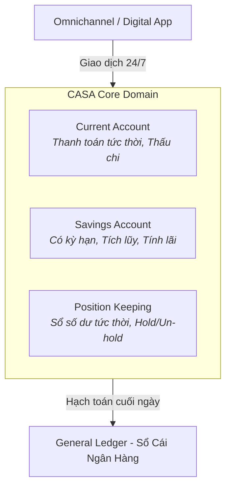
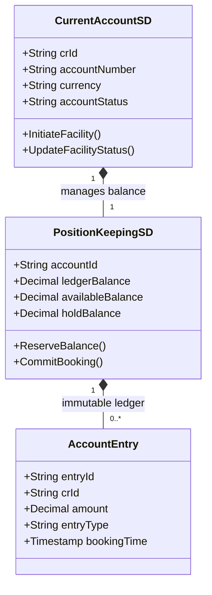
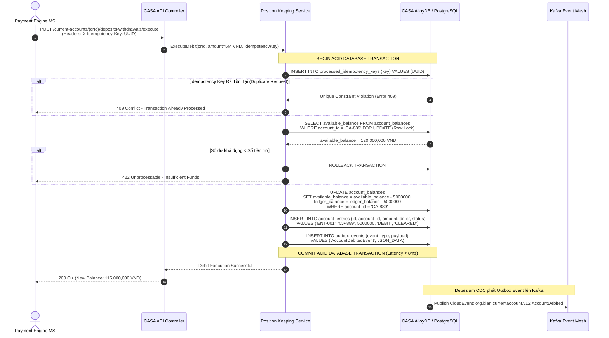

# Chương 6: Thiết Kế Microservices CASA (Current Account & Savings Account)

---

## 6.1 Tổng Quan Domain CASA & Ngữ Cảnh Nghiệp Vụ (Domain Overview & Business Context)

### 1. Bản chất của nghiệp vụ CASA trong Ngân hàng
**CASA (Current Account & Savings Account - Tài khoản Thanh toán & Tài khoản Tiết kiệm)** là cột sống (Spinal Cord) của bất kỳ hệ thống Core Banking nào. Đây là nơi lưu giữ toàn bộ số dư tiền gửi của khách hàng cá nhân và doanh nghiệp, là điểm xuất phát và điểm kết thúc của mọi luồng tiền thanh toán (Chuyển tiền NAPAS, Thanh toán Thẻ, Giải ngân cho vay, Thu nợ...).

- **Current Account (Tài khoản Thanh toán / Dòng tiền):** Tần suất giao dịch cực lớn (hàng chục giao dịch mỗi ngày trên 1 tài khoản), không kỳ hạn, cho phép thấu chi (Overdraft), yêu cầu xử lý thời gian thực 24/7/365 với độ trễ cực thấp.
- **Savings Account (Tài khoản Tiết kiệm):** Tần suất giao dịch thấp hơn nhưng quy tắc nghiệp vụ phức tạp về kỳ hạn (Term Deposit), lãi suất bậc thang, tất toán trước hạn (Early Withdrawal Penalty), và tự động tái tục (Rollover).



---

## 6.2 Yêu Cầu Nghiệp Vụ Cốt Lõi & Quy Trình Hoạt Động (Business Requirements & End-to-End Processes)

Trước khi thiết kế Microservice, chúng ta phải chuẩn hóa 3 luồng nghiệp vụ E2E quan trọng nhất của CASA:

### 1. Quy trình Mở Tài khoản & Cấu hình Hạn mức (Account Origination & Facility Setup)
- Khởi tạo hợp đồng tài khoản (Facility Agreement) gắn với một khách hàng duy nhất (`Party ID`).
- Định nghĩa các thuộc tính nghiệp vụ: Loại tiền tệ (VND/USD), hạn mức giao dịch ngày, hạn mức thấu chi được phê duyệt, trạng thái phong tỏa (Active/Frozen).

### 2. Quy trình Hạch toán Ghi Nợ / Ghi Có Thời gian thực (Real-time Debit & Credit Booking)
- Khi một giao dịch đến, hệ thống phải kiểm tra **Số dư khả dụng (Available Balance)** theo công thức:
  $$\text{Available Balance} = \text{Ledger Balance} + \text{Approved Overdraft Limit} - \text{Hold/Reserved Amount}$$
- Nếu hợp lệ: Thực hiện giữ chỗ tiền (Hold/Reserve) hoặc hạch toán trừ ngay lập tức vào số dư.
- Ghi vết bút toán (Account Entry) vào sổ phụ tài khoản với định danh giao dịch duy nhất.

### 3. Quy trình Phong tỏa & Giải tỏa Số dư (Balance Hold / Reservation)
- Phục vụ các giao dịch chuyển tiền liên ngân hàng hoặc thanh toán thẻ POS: Tiền bị phong tỏa tạm thời (Hold) trước khi có xác nhận tất toán (Clearing/Settlement).

---

## 6.3 Yêu Cầu Phi Chức Năng Cốt Lõi (Non-Functional Requirements - NFRs)

Nghiệp vụ CASA có tiêu chuẩn NFR khắt khe nhất trong toàn bộ ngân hàng:

| Tiêu chí NFR | Yêu cầu Kỹ thuật / Chỉ số Mục tiêu | Giải pháp Kiến trúc Đáp ứng |
| :--- | :--- | :--- |
| **Tính Nhất Quán (ACID Consistency & Anti Double-Spending)** | Tuyệt đối **KHÔNG BAO GIỜ** được phép âm số dư trái phép hoặc trừ tiền 2 lần cho 1 giao dịch. | Sử dụng **Row-level Pessimistic Locking (`SELECT FOR UPDATE`)** kết hợp **Idempotency Key unique constraint** trên Database. |
| **Độ Trễ Xử Lý (Processing Latency)** | Độ trễ cho 1 lệnh kiểm tra và trừ tiền nội bộ CASA phải **< 15ms** (p99). | Tối ưu index Database, chạy Microservice gần Datastore, tránh gọi chuỗi API mạng đồng bộ. |
| **Khả Năng Xử Lý Tải (Throughput / Scalability)** | Đạt tối thiểu **10,000+ TPS** vào giờ cao điểm (Ngày trả lương, Tết, Flash Sale). | Sharding Database theo `Account ID` hoặc `Customer ID` (Horizontal Partitioning). |
| **Khả Năng Kiểm Toán (Auditability & Immutability)** | Sổ bút toán (`account_entries`) chỉ được phép **INSERT (Append-only)**, tuyệt đối không cho phép `UPDATE` hay `DELETE` lịch sử giao dịch. | Thiết kế bảng Ledger immutable, mọi điều chỉnh sai sót phải thông qua bút toán đảo (Reversal Entry). |

---

## 6.4 Ánh Xạ BIAN Service Domains & Thiết Kế Microservice Chi Tiết

Dựa trên phân tích độ gắn kết giao dịch ACID (Transactional Cohesion) tại Chương 3, chúng ta nhóm các BIAN Service Domains liên quan thành **CASA Core Bounded Context**:



### 1. Phân chia chức năng bên trong CASA Core Microservice:
- **`Current Account SD`:** Quản lý Control Record `CurrentAccountFacility` (Trạng thái tài khoản, chủ sở hữu, cấu hình hạn mức).
- **`Position Keeping SD`:** Quản lý số dư tức thời (`account_balances`) và thực hiện hạch toán bút toán (`account_entries`).

---

## 6.5 Sequence Diagram: Hạch Toán Ghi Nợ Thời Gian Thực (Real-Time Debit Execution)

Dưới đây là biểu đồ tuần tự chi tiết xử lý một lệnh trừ tiền (Debit) đảm bảo 100% ACID và chống Double-Spending:



---

## 6.6 Đặc Tả API & Event Schema Chuẩn BIAN Cho CASA

### 1. API Spec: `POST /api/v1/current-account/facilities/{crId}/withdrawals/execute`
```json
{
  "$schema": "http://json-schema.org/draft-07/schema#",
  "title": "BIAN Current Account Withdrawal Execution Request",
  "type": "object",
  "required": ["amount", "currency", "transactionReference", "bookingType"],
  "properties": {
    "amount": { "type": "number", "minimum": 0.01, "example": 5000000.00 },
    "currency": { "type": "string", "pattern": "^[A-Z]{3}$", "example": "VND" },
    "transactionReference": { "type": "string", "example": "PAY-REF-88219" },
    "bookingType": { 
      "type": "string", 
      "enum": ["IMMEDIATE_DEBIT", "RESERVE_HOLD"],
      "example": "IMMEDIATE_DEBIT" 
    }
  }
}
```

### 2. Event Payload: `org.bian.currentaccount.v12.AccountBalanceUpdated`
```json
{
  "specversion": "1.0",
  "id": "evt-casa-99120",
  "source": "//banking.enterprise/casa/current-account-service",
  "type": "org.bian.currentaccount.v12.AccountBalanceUpdated",
  "time": "2026-07-10T10:35:00Z",
  "data": {
    "controlRecordId": "CA-889",
    "accountNumber": "190012345678",
    "entryReference": "ENT-001",
    "transactionAmount": -5000000.00,
    "currency": "VND",
    "balancesAfterBooking": {
      "ledgerBalance": 115000000.00,
      "availableBalance": 115000000.00,
      "holdBalance": 0.00
    },
    "valueDateTime": "2026-07-10T10:35:00Z"
  }
}
```

---

## 6.7 Tóm Tắt Chương 6

- Bối cảnh CASA yêu cầu sự chuẩn xác tuyệt đối về số dư, xử lý với tần suất cực cao và độ trễ dưới 15ms.
- Nhóm `Current Account SD` và `Position Keeping SD` vào chung một Bounded Context để tận dụng giao dịch ACID cơ sở dữ liệu cho các lệnh hạch toán.
- Luôn sử dụng cơ chế khóa dòng pessimistic (`SELECT FOR UPDATE`) kết hợp bảng Idempotency và Sổ phụ `account_entries` chỉ ghi (Immutable Append-Only Ledger).
