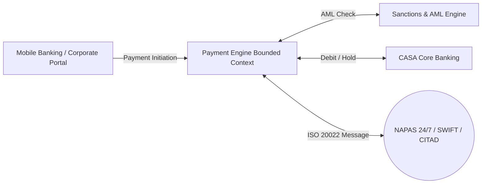
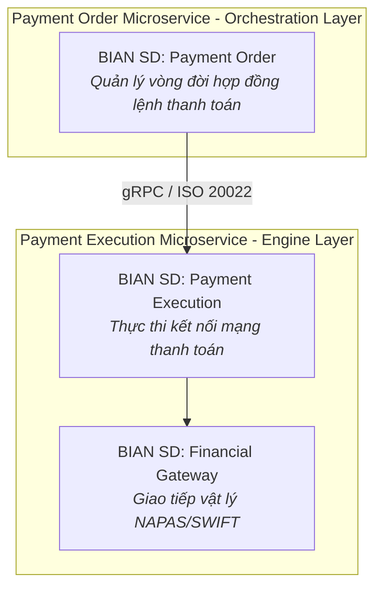
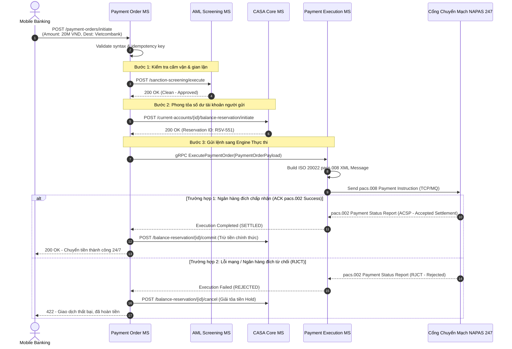

# Chương 7: Thiết Kế Payment Engine & Payment Execution

---

## 7.1 Tổng Quan Domain Thanh Toán & Ngữ Cảnh Nghiệp Vụ (Domain Overview & Business Context)

### 1. Bối cảnh Thanh toán Ngân hàng Hiện đại
Trong một ngân hàng, "Payments Domain (Miền Thanh toán)" là hệ thống chịu tải nặng nhất và có tốc độ tăng trưởng lưu lượng giao dịch nhanh nhất. Sự bùng nổ của thanh toán mã QR, ví điện tử và chuyển tiền nhanh 24/7 (như "NAPAS 247" tại Việt Nam, "SEPA Instant" tại châu Âu, "FedNow" tại Mỹ) đã thay đổi hoàn toàn yêu cầu kiến trúc:

- Chuyển dịch từ xử lý theo lô cuối ngày (Batch Clearing / ACH) sang "Thanh toán Thời gian thực từng giao dịch (Real-Time Gross Settlement / Instant Payment)".
- Hệ thống thanh toán phải vận hành liên tục 24/7/365, không có "khung giờ bảo trì đêm" làm gián đoạn chuyển tiền.

---

## 7.2 Yêu Cầu Nghiệp Vụ Cốt Lõi (Functional & Business Requirements)

Một hệ thống Payment Engine kiến trúc Microservice phải đáp ứng trọn vẹn chu trình nghiệp vụ 5 bước:

1. "Khởi tạo & Kiểm tra cú pháp (Payment Order Initiation & Syntax Validation):" Tiếp nhận yêu cầu chuyển tiền từ các kênh, kiểm tra tính hợp lệ của số tài khoản thụ hưởng, mã ngân hàng đích (BIN/BIC) và định dạng số tiền.
2. "Sanction Screening & AML Check:" Rà soát tự động danh sách cấm vận (Blacklist / Watchlist screening) và rửa tiền trước khi cho phép dòng tiền rời khỏi ngân hàng.
3. "Hạch toán Phong tỏa Số dư CASA (Funds Reservation):" Gọi sang CASA Microservice để giữ chỗ (Hold) số tiền gốc cùng phí chuyển tiền.
4. "Định tuyến Thanh toán (Smart Payment Routing):" Dựa vào số tiền, ngân hàng đích và độ ưu tiên để tự động chọn mạng lưới thanh toán rẻ nhất/nhanh nhất (NAPAS 24/7 hay CITAD chuyển khoản liên ngân hàng lớn hay SWIFT quốc tế).
5. "Thực thi & Quyết toán (Payment Execution & Settlement):" Đóng gói thông điệp gửi ra cổng thanh toán quốc gia và chờ xác nhận tất toán thành công/thất bại để hạch toán chính thức.

---

## 7.3 Yêu Cầu Phi Chức Năng Cốt Lõi (Non-Functional Requirements - NFRs)

| Tiêu chí NFR | Yêu cầu Kỹ thuật / Chỉ số SLA | Giải pháp Kiến trúc BIAN Microservice |
| :--- | :--- | :--- |
| "Độ Trễ Toàn Chặng (End-to-End Latency SLA)" | Thời gian từ lúc bấm chuyển tiền đến lúc nhận phản hồi thành công phải < 2,000ms (2 giây) theo SLA của NAPAS/SEPA Instant. | Tối ưu hóa pipeline xử lý bằng Asynchronous Reactive Programming (WebFlux / Go Routines) và kết nối gRPC nội bộ. |
| "Độ Sẵn Sàng (High Availability)" | Đạt mức "99.999% (Five Nines)" – Thời gian gián đoạn tối đa 5 phút/năm. | Multi-region Active-Active Kubernetes deployment, cơ chế tự động chuyển hướng mạch (Circuit Breaker) khi cổng NAPAS chậm. |
| "Khả Năng Phục Hồi & Đối Soát (Resilience & Reconciliation)" | Xử lý triệt để các tình huống "Timeout rớt mạng giữa chừng" với ngân hàng đối tác. | Cơ chế "Automated Status Inquiry (Truy vấn trạng thái tự động)" sau 5s/15s/30s và Sổ đối soát nhật ký tự động (Automated Clearing Reconciliation). |

---

## 7.4 Ánh Xạ BIAN Service Domains & Kiến Trúc Microservices

Trong BIAN Service Landscape, Domain Thanh toán được tách thành 3 Service Domain cốt lõi với mức độ độ mịn (Granularity) được tách biệt thành 2 Microservices độc lập:

- "`Payment Order SD` (Microservice Khởi tạo Lệnh Thanh toán):" Sở hữu Control Record `Payment Order`. Quản lý trạng thái logic của lệnh (Draft -> Pending Approval -> AML Verified -> Executed -> Settled).
- "`Payment Execution SD` & `Financial Gateway SD` (Microservice Thực thi & Cổng Thanh toán):" Sở hữu Control Record `Payment Execution`. Chịu trách nhiệm dịch thông điệp sang chuẩn ISO 20022 vật lý và duy trì kết nối socket/MQ với trung tâm chuyển mạch quốc gia.

---

## 7.5 Sequence Diagram: Luồng Chuyển Tiền Nhanh Liên Ngân Hàng 24/7 (Real-Time Outward Payment)

---

## 7.6 Tóm Tắt Chương 7

- Thanh toán hiện đại đòi hỏi tốc độ xử lý dưới 2 giây và khả năng hoạt động 24/7 không gián đoạn.
- Tách biệt "Payment Order MS (lưu trạng thái & điều phối nghiệp vụ)" và "Payment Execution MS (dịch thông điệp & giao tiếp cổng chuyển mạch)".
- Luôn áp dụng cơ chế phong tỏa số dư (Reserve Hold) trước khi gửi điện thanh toán ra ngoài để bảo vệ ngân hàng trước rủi ro rớt mạng trung gian.
