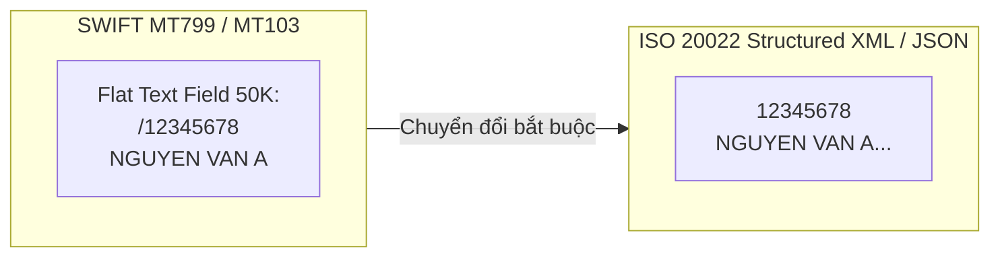
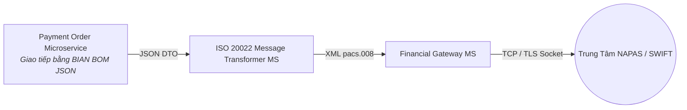

# Chương 8: Chuẩn Hóa Giao Tiếp ISO 20022 & Payment Order Microservice

---

## 8.1 Cuộc Cách Mạng ISO 20022 Trong Hệ Thống Thanh Toán

Trong nhiều thập kỷ, thanh toán tài chính toàn cầu phụ thuộc vào chuẩn điện văn "SWIFT MT (Message Type)" – một định dạng văn bản phẳng (Flat-text) cực kỳ hạn chế về trường thông tin (ví dụ: trường tên người thụ hưởng bị cắt xén ở 35 ký tự). Điều này dẫn đến tỷ lệ điều tra thủ công cao và cản trở tự động hóa AML.

"ISO 20022" ra đời như một tiêu chuẩn cấu trúc XML/JSON giàu ngữ nghĩa (Rich Data Standard), cho phép truyền tải đầy đủ chi tiết định danh, địa chỉ, mục đích chuyển tiền và hóa đơn chứng từ kèm theo.



---

## 8.2 Các Thông Điệp ISO 20022 Cốt Lõi Trong Payment Microservices

Khi thiết kế `Payment Order Microservice`, kỹ sư cần nắm vững bộ thông điệp ISO 20022 tương ứng cho từng ngữ cảnh:

| Mã Thông Điệp ISO 20022 | Tên chuẩn quốc tế | Vai trò trong hệ thống Microservices |
| :--- | :--- | :--- |
| pain.001 *(Customer-to-Bank)* | Customer Credit Transfer Initiation | Điện văn khách hàng từ Mobile App / Corporate Internet Banking gửi lệnh chuyển tiền đến ngân hàng. |
| pacs.008 *(Bank-to-Bank)* | FI-to-FI Customer Credit Transfer | Điện văn chuyển khoản chính thức giữa Ngân hàng Người gửi (Debtor Agent) và Ngân hàng Thụ hưởng (Creditor Agent). |
| pacs.002 *(Bank-to-Bank)* | FI-to-FI Payment Status Report | Thông điệp báo cáo trạng thái thanh toán (ACSP = Accepted Settlement Completed; RJCT = Rejected). |
| pacs.004 *(Bank-to-Bank)* | Payment Return | Điện văn hoàn trả tiền tự động khi tài khoản đích bị đóng hoặc sai số tài khoản. |
| camt.054 *(Bank-to-Customer)* | Bank-to-Customer Debit/Credit Notification | Bản tin thông báo ghi nợ/ghi có gửi từ Core Banking về kênh thông báo cho khách hàng. |

---

## 8.3 Ánh Xạ BIAN Semantic API Với ISO 20022 (BIAN-to-ISO Mapping)

BIAN Business Object Model (BOM) được thiết kế đồng chỉnh 100% với từ điển dữ liệu ISO 20022. Dưới đây là bảng ánh xạ thực chiến từ "BIAN JSON Property" sang "ISO 20022 XML XPath (`pacs.008`)":

| BIAN Semantic API JSON Field | ISO 20022 XML XPath (`pacs.008`) | Ý nghĩa nghiệp vụ |
| :--- | :--- | :--- |
| `paymentOrderReference` | `/Document/FIToFICstmrCdtTrf/GrpHdr/MsgId` | Mã định danh duy nhất của gói tin thanh toán |
| `instructedAmount.amount` | `/Document/FIToFICstmrCdtTrf/CdtTrfTxInf/IntrBkSttlmAmt` | Số tiền hạch toán chuyển khoản |
| `debtorAccount.accountNumber` | `/Document/FIToFICstmrCdtTrf/CdtTrfTxInf/DbtrAcct/Id/Othr/Id` | Số tài khoản người gửi tiền |
| `debtorAgent.bic` | `/Document/FIToFICstmrCdtTrf/CdtTrfTxInf/DbtrAgt/FinInstnId/BICFI` | Mã BIC Ngân hàng gửi tiền |
| `creditorAccount.accountNumber` | `/Document/FIToFICstmrCdtTrf/CdtTrfTxInf/CdtrAcct/Id/Othr/Id` | Số tài khoản người thụ hưởng |
| `remittanceInformation` | `/Document/FIToFICstmrCdtTrf/CdtTrfTxInf/RmtInf/Ustrd` | Nội dung chuyển tiền (Lên tới 140 ký tự tiếng Việt có dấu) |

---

## 8.4 Kiến Trúc Message Translation Engine (Bộ Chuyển Đổi ISO 20022)

Trong nội bộ hệ thống Microservices ngân hàng, việc truyền tải trực tiếp file XML ISO 20022 nặng nề sẽ làm giảm hiệu năng parsing của CPU. Do đó, ngân hàng áp dụng mô hình kiến trúc "JSON Native Inside - XML ISO Outside":



---

## 8.5 Đặc Tả OpenAPI Chuẩn BIAN Cho Payment Order Microservice

Dưới đây là mẫu OpenAPI Specification hoàn chỉnh cho `POST /payment-orders/initiate` tương thích hoàn toàn với cấu trúc ISO 20022 `pain.001`:

```yaml
openapi: 3.0.3
info:
  title: BIAN Payment Order Service Domain API
  version: 12.0.0
paths:
  /api/v1/payments/sd-payment-order/payment-orders/initiate:
    post:
      summary: Initiate an Inter-Bank Payment Order (ISO 20022 Aligned)
      operationId: initiatePaymentOrder
      parameters:
        - name: X-Idempotency-Key
          in: header
          required: true
          schema:
            type: string
            format: uuid
      requestBody:
        required: true
        content:
          application/json:
            schema:
              $ref: '#/components/schemas/PaymentOrderInitiateRequest'
      responses:
        '201':
          description: Payment Order Created & Processing Initiated
          content:
            application/json:
              schema:
                $ref: '#/components/schemas/PaymentOrderResponse'
components:
  schemas:
    PaymentOrderInitiateRequest:
      type: object
      required:
        - debtorAccount
        - creditorAccount
        - instructedAmount
        - executionType
      properties:
        executionType:
          type: string
          enum: ["REAL_TIME_INSTANT", "DOMESTIC_ACH", "CROSS_BORDER_SWIFT"]
          example: "REAL_TIME_INSTANT"
        instructedAmount:
          type: object
          required: ["amount", "currency"]
          properties:
            amount: { type: "number", example: 15000000.00 }
            currency: { type: "string", example: "VND" }
        debtorAccount:
          type: object
          properties:
            accountNumber: { type: "string", example: "190011223344" }
        creditorAccount:
          type: object
          properties:
            accountNumber: { type: "string", example: "0071000998877" }
            bankBic: { type: "string", example: "BFTVVNVX" }
            accountHolderName: { type: "string", example: "TRAN THI B" }
        remittanceInformation:
          type: string
          example: "THANH TOAN HOP DONG SO 9982"
    PaymentOrderResponse:
      type: object
      properties:
        paymentOrderReference:
          type: string
          example: "PO-20260710-VN-99120"
        orderStatus:
          type: string
          enum: ["INITIATED", "HOLD_SUCCESS", "SETTLED", "REJECTED"]
          example: "INITIATED"
        iso20022EndToEndId:
          type: string
          example: "E2E-998210029182"
```

---

## 8.6 Tóm Tắt Chương 8

- "ISO 20022" là chuẩn mực bắt buộc cho hệ thống thanh toán toàn cầu với cấu trúc ngữ nghĩa phong phú hơn hẳn SWIFT MT cũ.
- Sử dụng mô hình "JSON Native Inside - XML ISO Outside" để vừa đảm bảo tốc độ xử lý Microservice nội bộ, vừa tương thích tuyệt đối với các cổng thanh toán quốc gia.
- BIAN BOM cung cấp ánh xạ tự nhiên 1:1 sang các trường thông tin XPath của pacs.008 và pain.001.
