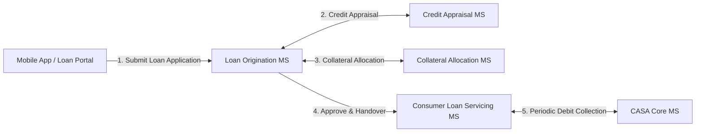
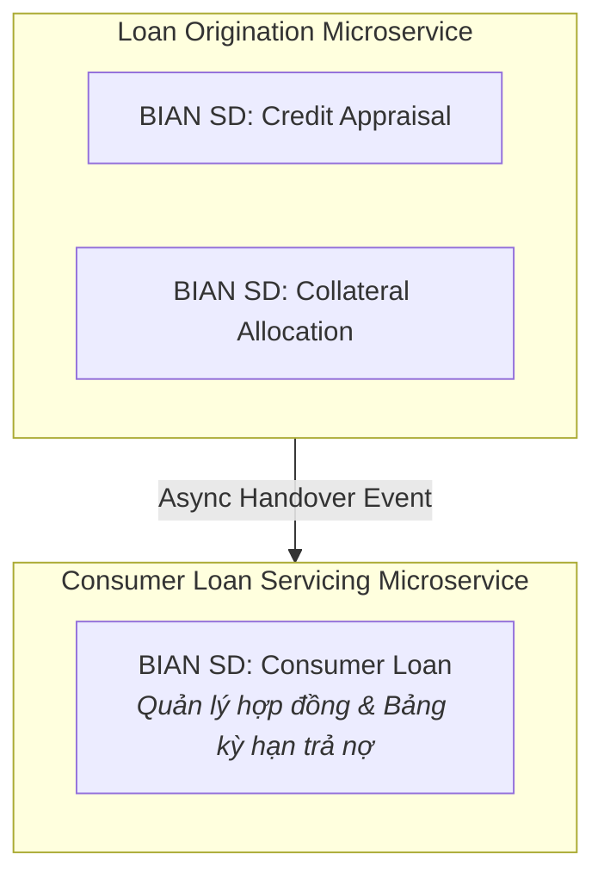
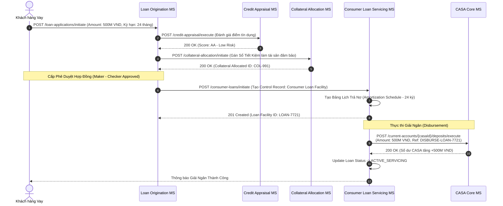

# Chương 9: Thiết Kế Hệ Thống Tín Dụng (Loan Origination & Servicing)

---

## 9.1 Tổng Quan Domain Tín Dụng & Ngữ Cảnh Nghiệp Vụ (Domain Overview & Business Context)

### 1. Bản chất nghiệp vụ Tín dụng Ngân hàng
Tín dụng (Lending / Credit) là nguồn thu nhập cốt lõi của ngân hàng thương mại. Khác với CASA hay Payments vốn có vòng đời giao dịch diễn ra trong vài giây, một khoản vay có vòng đời kéo dài nhiều tháng đến nhiều năm (từ vay tiêu dùng 6 tháng đến vay mua nhà 30 năm).

Hệ thống Tín dụng hiện đại được phân tách thành 2 vùng nghiệp vụ chính:
- **Loan Origination System (LOS - Khởi tạo Khoản vay):** Xử lý luồng tiếp nhận hồ sơ, chấm điểm tín dụng (Credit Scoring), thẩm định tài sản đảm bảo (Collateral Valuation) và phê duyệt hợp đồng.
- **Loan Servicing System (LSS - Quản trị Vận hành Khoản vay):** Xử lý luồng sau giải ngân: Lập bảng tính lãi/trả nợ kỳ hạn (Amortization Schedule), thu nợ tự động định kỳ (Collection) và theo dõi nợ quá hạn (NPL / Arrears Management).

---

## 9.2 Yêu Cầu Nghiệp Vụ Cốt Lõi & Quy Trình Hoạt Động (End-to-End Processes)

Hệ thống Microservices Tín dụng phải quản lý trọn vẹn quy trình 6 bước chuẩn:

1. **Tiếp nhận Yêu cầu Vay (Loan Application Submission):** Nhận thông tin thu nhập, mục đích vay và số tiền đề nghị.
2. **Thẩm định Tín dụng (Credit Appraisal & Scoring):** Kết nối trung tâm thông tin tín dụng (CIC) và chạy mô hình chấm điểm rủi ro tự động.
3. **Định giá & Ghi nhận Tài sản Đảm bảo (Collateral Allocation):** Liên kết tài sản thế chấp (bất động sản, ô tô, sổ tiết kiệm) vào khoản vay.
4. **Phê duyệt & Tạo Hợp đồng Vay (Facility Creation):** Cấp hạn mức tín dụng và ký kết hợp đồng vay chính thức (`Consumer Loan Facility`).
5. **Giải ngân (Disbursement Execution):** Hạch toán chuyển tiền vay vào tài khoản thanh toán CASA của khách hàng hoặc bên thứ ba.
6. **Thu nợ Định kỳ (Direct Debit Installment Collection):** Tự động trừ tiền kỳ hạn hàng tháng từ tài khoản CASA theo bảng lịch trả nợ.

---

## 9.3 Yêu Cầu Phi Chức Năng Cốt Lõi (Non-Functional Requirements - NFRs)

| Tiêu chí NFR | Yêu cầu Kỹ thuật / Chỉ số Mục tiêu | Giải pháp Kiến trúc Microservice |
| :--- | :--- | :--- |
| **Tính Chính Xác Toán Học tuyệt đối (Mathematical Precision)** | Không được phép sai lệch dù chỉ 1 đồng trong công thức tính lãi dư nợ giảm dần hoặc dư nợ ban đầu. | Bắt buộc sử dụng kiểu dữ liệu `BigDecimal` / `Numeric(18,4)` trong backend và Database, tuyệt đối không dùng `Floating Point`. |
| **Bảo Lưu Trạng Thái Vòng Đời (Long-Running State Machine)** | Hồ sơ vay có thể nằm ở trạng thái "Chờ thẩm định bổ sung" trong 3-5 ngày mà không mất dữ liệu. | Quản lý vòng đời hợp đồng bằng **Persistent State Machine (Workflow Engine như Temporal/Camunda)**. |
| **Tuân Thủ Kiểm Toán Phê Duyệt (Audit & Dual Authorization)** | Mọi quyết định thay đổi lãi suất hoặc phê duyệt khoản vay lớn phải ghi vết chữ ký số/người phê duyệt 4-mắt (Maker-Checker). | Lưu trữ chữ ký phê duyệt trong `Control Record Audit Header` không thể chỉnh sửa. |

---

## 9.4 Ánh Xạ BIAN Service Domains & Kiến Trúc Microservices

Để tránh tải xử lý nặng nề của thẩm định hồ sơ ảnh hưởng đến vận hành thu nợ hàng ngày, chúng ta tách thành 3 Microservices Bounded Contexts:

---

## 9.5 Sequence Diagram: Quy Trình Khởi Tạo, Phê Duyệt & Giải Ngân Khoản Vay (E2E Loan Origination to Disbursement)

---

## 9.6 Tóm Tắt Chương 9

- Hệ thống tín dụng phải tách biệt rõ ràng giữa **LOS (Khởi tạo & Thẩm định - Workflow nặng)** và **LSS (Servicing & Thu nợ - Tính toán chính xác kỳ hạn)**.
- BIAN `Consumer Loan SD` chịu trách nhiệm duy trì Control Record hợp đồng vay và bảng tính kỳ hạn trả nợ chính xác theo số học (`BigDecimal`).
- Giải ngân và thu nợ tự động được thực hiện qua tích hợp API/Event trực tiếp với `CASA Microservice`.
