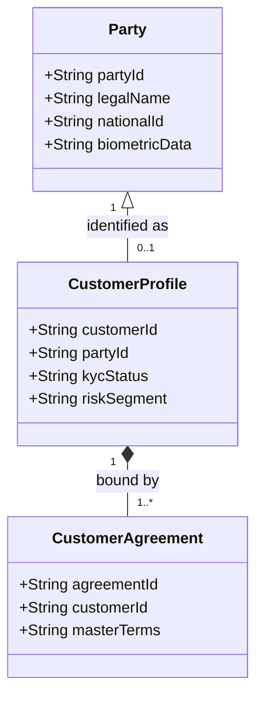
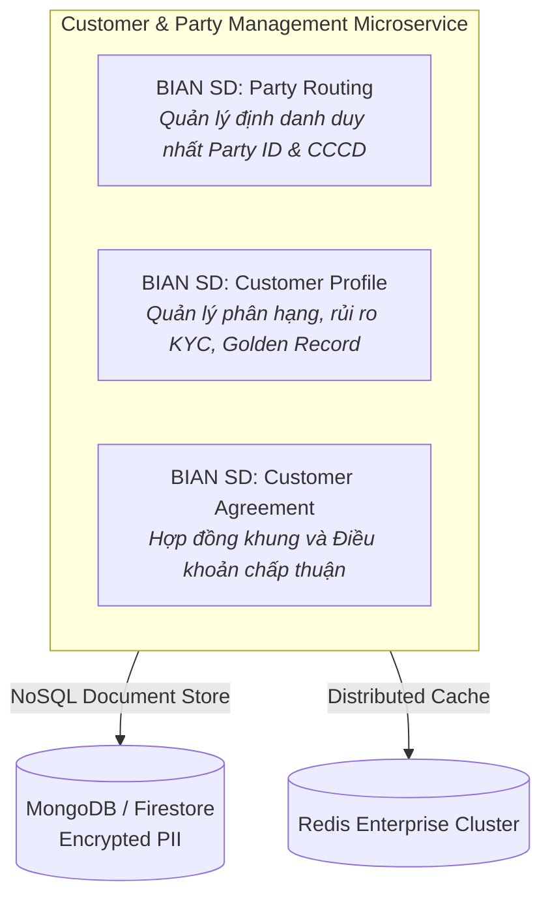
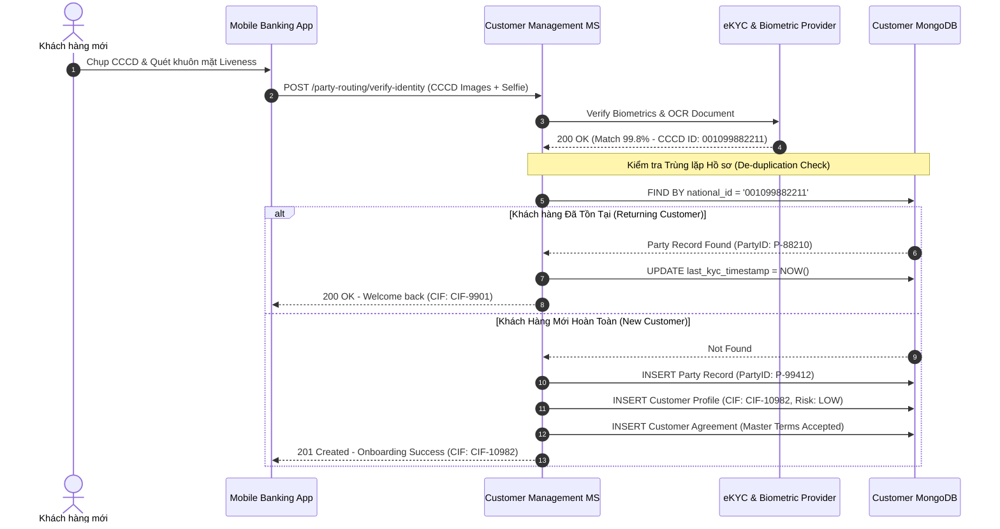

# Chương 10: Quản Trị Khách Hàng Định Danh Duy Nhất (Party Management & KYC)

---

## 10.1 Tổng Quan Domain Khách Hàng & Ngữ Cảnh Nghiệp Vụ (Domain Overview & Business Context)

### 1. Vấn nạn "Khách hàng Phân mảnh" tại các Ngân hàng truyền thống
Trong kiến trúc liền khối cũ, mỗi phân hệ sản phẩm tự duy trì một bảng khách hàng riêng:
- Core CASA có bảng `CLIENT` theo số CIF.
- Hệ thống Thẻ Credit Card có bảng `CARD_HOLDER`.
- Hệ thống Vay có bảng `BORROWER`.

Hậu quả là một người dùng có thể sở hữu 3 mã khách hàng khác nhau trong cùng một ngân hàng. Khi khách hàng đổi số điện thoại hoặc địa chỉ nhà, họ phải đến quầy làm thủ tục sửa đổi 3 lần, nếu không các hệ thống sẽ gửi tin nhắn sai lệch.

### 2. Triết lý "Party vs Customer" trong BIAN
BIAN phân biệt rất rõ ràng giữa hai khái niệm:
- **Party (Thực thể / Bên tham gia):** Một cá nhân hoặc tổ chức hợp pháp tồn tại ngoài xã hội (có số CCCD/Hộ chiếu/Mã số thuế). Một Party có thể chưa phải là khách hàng (ví dụ: người bảo lãnh vay, đối tác cung cấp dịch vụ).
- **Customer (Khách hàng):** Một `Party` chính thức có mối quan hệ kinh doanh với ngân hàng thông qua ít nhất một hợp đồng sản phẩm (`Customer Agreement`).

---

## 10.2 Yêu Cầu Nghiệp Vụ Cốt Lõi (Functional Requirements)

1. **eKYC & Xác thực Định danh (Identity Verification):** Kiểm tra tính thật/giả của CCCD gắn chip, khớp khuôn mặt sinh trắc học (Liveness Detection) và xác thực với cơ sở dữ liệu quốc gia về dân cư.
2. **Loại bỏ Trùng lặp & Tạo Bản ghi Vàng (De-duplication & Golden Record MDM):** Tự động phát hiện nếu `Party` đã từng tồn tại trong hệ thống (dựa vào số CCCD/Hộ chiếu) để gộp hồ sơ, tạo ra một **Single Source of Truth (Góc nhìn 360 độ duy nhất)**.
3. **Quản trị Đồng ý & Bảo mật Riêng tư (PDPA / Consent Management):** Ghi nhận rõ ràng quyền đồng ý của khách hàng về việc xử lý dữ liệu cá nhân theo quy định pháp luật (Nghị định 13/GDPR).

---

## 10.3 Yêu Cầu Phi Chức Năng Cốt Lõi (Non-Functional Requirements - NFRs)

| Tiêu chí NFR | Yêu cầu Kỹ thuật / Chỉ số SLA | Giải pháp Kiến trúc BIAN Microservice |
| :--- | :--- | :--- |
| **Đặc thù Tải Truy vấn (Read-Heavy Profile)** | Tỷ lệ đọc/ghi là **95% Read / 5% Write**. Mọi giao dịch tài chính hay truy cập app đều gọi GET thông tin khách hàng. | Xây dựng bộ nhớ đệm phân tán **Redis Cluster / CQRS Read Model** để phản hồi GET API **< 5ms**. |
| **Bảo Mật Dữ Liệu Nhạy Cảm (PII Protection)** | Thông tin cá nhân (CCCD, Số điện thoại, Email, Sinh trắc học) bắt buộc phải mã hóa. | Áp dụng **Field-Level Encryption (AES-256-GCM)** trong Database và che giấu (Data Masking) trên log ứng dụng. |
| **Tính Nhất Quán Toàn Ngân Hàng** | Khi khách hàng cập nhật số điện thoại, toàn bộ các Domain khác (Thẻ, Vay, CASA) phải cập nhật ngay lập tức. | Phát sự kiện `CustomerProfileUpdatedEvent` qua Kafka để các miền cập nhật Read Model của họ. |

---

## 10.4 Ánh Xạ BIAN Service Domains & Kiến Trúc Microservices

Chúng ta thiết kế **Customer Management Bounded Context** hội tụ 3 BIAN Service Domains cốt lõi:

---

## 10.5 Sequence Diagram: Quy Trình Digital Onboarding & Tạo Bản Ghi Vàng (Golden Record)

---

## 10.6 Tóm Tắt Chương 10

- Tách bạch khái niệm **Party (Thực thể định danh)** và **Customer (Hồ sơ khách hàng ngân hàng)** theo chuẩn BIAN.
- Sử dụng **NoSQL Document Database** để linh hoạt mở rộng các trường thông tin KYC và áp dụng mã hóa mức trường (**Field-Level Encryption**) cho dữ liệu PII.
- Xây dựng **Redis Cache Cluster** để phục vụ lượng truy vấn đọc cực lớn từ tất cả các kênh giao dịch.
