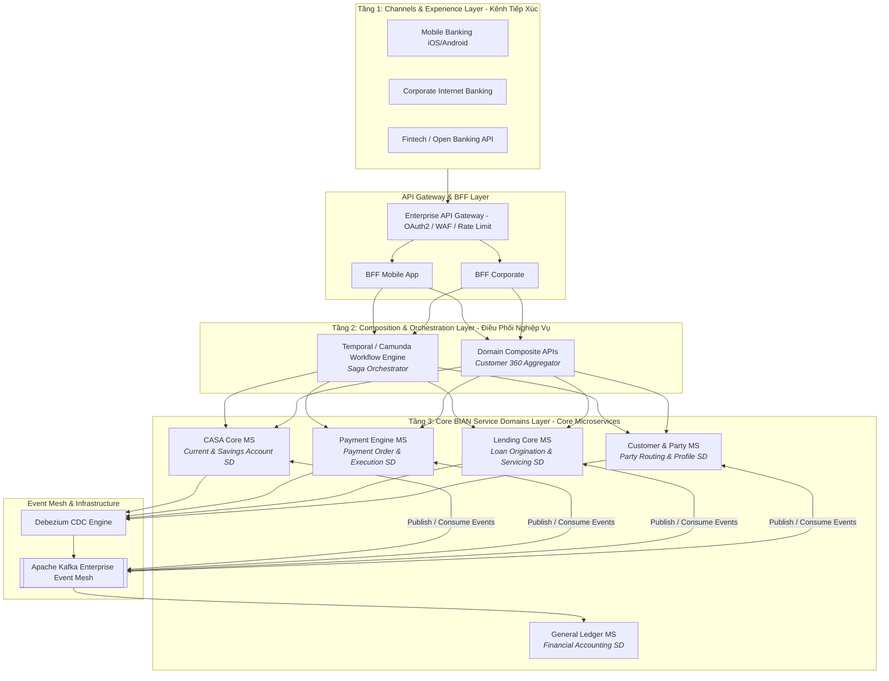

# Chương 11: Tổng Thể Master Banking Microservices Blueprint

---

## 11.1 Kiến Trúc Ngân Hàng Số 3 Tầng (3-Layer Modern Banking Architecture)

Sau khi đã thiết kế chi tiết từng Domain cốt lõi từ Chương 6 đến Chương 10, nhiệm vụ tối thượng của Enterprise Architect là ghép nối tất cả lại thành một "Bản đồ Kiến trúc Tổng thể (Master Banking Microservices Blueprint)".

Kiến trúc Ngân hàng Số hiện đại được chia thành "3 tầng rõ rệt (3-Tier Decoupled Layering)" nhằm cách ly các thay đổi về giao diện người dùng khỏi logic nghiệp vụ lõi:

---

## 11.2 Chi Tiết Các Tầng Trong Master Blueprint

### 1. Tầng 1: Experience & Channel Layer (Kênh & Trải nghiệm)
- Chứa các ứng dụng tiếp xúc trực tiếp với khách hàng hoặc đối tác.
- Giao tiếp với backend thông qua "API Gateway" và mô hình "Backend-For-Frontend (BFF)". BFF giúp tối ưu hóa payload trả về cho từng loại thiết bị (ví dụ: Mobile cần JSON nhỏ gọn, Web Portal doanh nghiệp cần bảng dữ liệu chi tiết).

### 2. Tầng 2: Composition & Process Orchestration Layer (Điều phối Luồng Nghiệp vụ)
- Nơi vận hành các luồng nghiệp vụ dài (Long-Running Workflows) và Saga Orchestration (ví dụ: Mở tài khoản eKYC trọn gói, Khởi tạo khoản vay từ A-Z).
- Các "Composite APIs" tại đây tổng hợp dữ liệu từ nhiều Microservices Core (ví dụ: Gọi `Customer MS` lấy tên, gọi `CASA MS` lấy số dư, gọi `Lending MS` lấy danh sách khoản nợ để tạo màn hình Home App Banking).

### 3. Tầng 3: Core BIAN Service Domains Layer (Hệ thống Core Microservices)
- Đây là nơi trú ngụ của các "Bounded Contexts" mà chúng ta đã thiết kế theo BIAN Service Landscape.
- Mỗi Microservice ở tầng này là một "System of Record (Hệ thống sở hữu dữ liệu gốc)" độc lập, có Database riêng theo nguyên tắc Polyglot Persistence.

---

## 11.3 Tầng Giao Tiếp Chéo: Event Mesh & Observability

Để hệ thống hàng trăm Microservice không biến thành một "mớ hỗn độn không thể kiểm soát", ngân hàng trang bị 2 trụ cột hạ tầng xuyên suốt:

### 1. Enterprise Kafka Event Mesh
- Đóng vai trò xương sống bất đồng bộ. Mọi thay đổi tài sản (Control Record mutated) đều phát ra chuẩn "CloudEvent BIAN BOM".
- Hệ thống "General Ledger (Sổ Cái Kế Toán Ngân Hàng)" lắng nghe toàn bộ sự kiện hạch toán tài chính từ `CASA MS`, `Payment MS`, `Lending MS` để tổng hợp bảng cân đối kế toán cuối ngày một cách hoàn toàn tự động mà không cần chạy batch jobs cồng kềnh.

### 2. Full-Stack Observability (OpenTelemetry)
- Mọi request đi từ Mobile App vào API Gateway đều được gắn một `X-Correlation-ID` duy nhất.
- Khi giao dịch đi qua 10 Microservices khác nhau, kỹ sư có thể nhìn thấy toàn bộ Distributed Trace trên "Grafana / Jaeger / Datadog" để phát hiện nút thắt cổ chai độ trễ (Latency Bottleneck) trong tích tắc.

---

## 11.4 Tóm Tắt Chương 11

- Master Banking Blueprint kết hợp hoàn hảo giữa "BIAN Service Domains (Tầng Core)" và "DDD Orchestration Layer (Tầng Điều phối)".
- Giao tiếp đồng bộ (REST/gRPC) chỉ dùng cho truy vấn tức thời hoặc lệnh khởi tạo; giao tiếp bất đồng bộ (Kafka Event Mesh) dùng cho đồng bộ trạng thái và hạch toán Sổ Cái.
- Lớp BFF và API Gateway bảo vệ Core Banking khỏi các đợt tấn công DDOS hoặc tải đột biến từ kênh đối tác bên ngoài.
