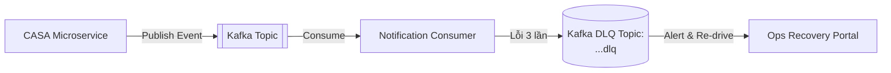

# Chương 12: Integration Architecture (Choreography vs Orchestration & Event Mesh)

---

## 12.1 Ma Trận Quyết Định: Khi Nào Dùng Choreography, Khi Nào Dùng Orchestration?

Trong kiến trúc Master Banking Blueprint, việc lựa chọn mô hình tích hợp giữa các BIAN Service Domains quyết định độ ổn định của hệ thống. Nếu dùng sai mô hình, ngân hàng sẽ rơi vào cảnh: **Code rất dễ viết lúc đầu nhưng không ai dám sửa đổi sau 2 năm vận hành**.

| Tiêu chí | Choreography (Vũ đạo - Phi tập trung) | Orchestration (Nhạc trưởng - Tập trung) |
| :--- | :--- | :--- |
| **Cơ chế hoạt động** | Service A phát Event lên Kafka. Service B tự lắng nghe và xử lý tiếp mà Service A không cần biết Service B là ai. | Một **Orchestrator Service** (Temporal/Camunda) gọi tuần tự từng Service A, B, C và theo dõi trạng thái chung. |
| **Độ phức tạp quy trình** | Phù hợp cho quy trình đơn giản **2 - 3 bước**, không có logic rẽ nhánh phức tạp. | Phù hợp cho quy trình **4 bước trở lên**, nhiều nhánh điều kiện, cần cơ chế bù trừ (Compensating Rollback). |
| **Khả năng quan sát (Auditability)** | Khó theo dõi trạng thái tổng thể của giao dịch đang nằm ở bước nào. | Dễ dàng nhìn thấy ngay Dashboard trạng thái hồ sơ vay hoặc lệnh thanh toán. |
| **Ví dụ áp dụng trong Ngân hàng** | - Thông báo biến động số dư qua SMS/Email.<br>- Đồng bộ Read Model cho CRM. | - Quy trình Mở tài khoản eKYC trọn gói.<br>- Chuyển tiền liên ngân hàng 4 bước.<br>- Khởi tạo và Giải ngân khoản vay. |

---

## 12.2 Quản Trị Chuẩn Hóa Event Mesh (Kafka Governance)

Một hệ thống ngân hàng lớn xử lý hàng tỷ sự kiện mỗi ngày. Để duy trì tính trật tự, chúng ta thiết lập 3 tiêu chuẩn bắt buộc cho Event Mesh:

### 1. Quy chuẩn Đặt tên Kafka Topic theo BIAN Hierarchy
Quy tắc đặt tên topic phản ánh chính xác cấu trúc BIAN Service Landscape:
```text
banking.{env}.{business-domain}.{service-domain}.{control-record}.v{version}
```
*Ví dụ thực tế:*
- `banking.prod.currentaccount.sd-currentaccount.accountbalances.v12`
- `banking.prod.payments.sd-paymentorder.paymentorders.v12`

### 2. Quản Trị Hợp Đồng Sự Kiện Với Schema Registry
- Mọi bản tin Kafka phát đi bắt buộc phải đăng ký lược đồ với **Confluent Schema Registry** (sử dụng JSON Schema hoặc Protobuf dẫn xuất từ BIAN BOM).
- Trước khi một Producer Microservice phát event, Kafka Broker sẽ kiểm tra tương thích ngược (Backward Compatibility Check). Nếu Developer vô tình xóa một trường bắt buộc trong BOM, lệnh `publish` sẽ bị từ chối ngay lập tức để bảo vệ các Consumer đang vận hành.

### 3. Xử Lý Giao Dịch Lỗi & Dead Letter Queue (DLQ)
Trong giao dịch tài chính, tuyệt đối không cho phép "xóa bỏ sự kiện bị lỗi" (Poison Message). Khi một Consumer không thể xử lý event sau 3 lần thử lại (Retries với Exponential Backoff), sự kiện phải được chuyển vào **Dead Letter Queue (DLQ)** kèm theo thông tin stack trace lỗi để nhân viên vận hành kiểm tra và đối soát lại.



---

## 12.3 Tóm Tắt Chương 12

- Sử dụng **Orchestration** cho các nghiệp vụ tài chính có trạng thái phức tạp, cần tính kiên định cao và dễ kiểm toán (Lending, Payments, eKYC).
- Sử dụng **Choreography** cho các tác vụ phi tài chính, phản ứng nhanh (Gửi thông báo, Cập nhật Cache).
- Áp dụng nghiêm ngặt **Schema Registry** và cấu trúc **Dead Letter Queue (DLQ)** để giữ cho Event Mesh ngân hàng luôn an toàn và chuẩn xác.
