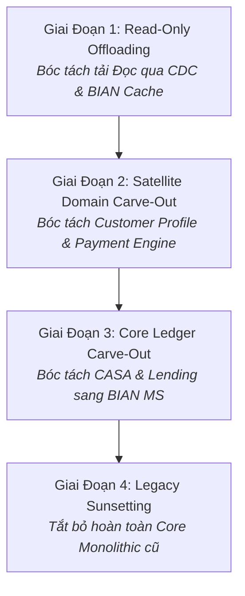
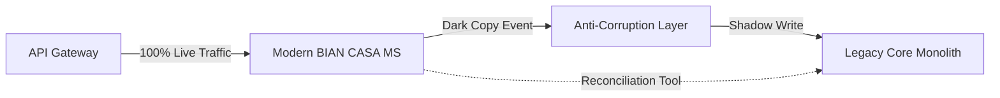

# Chương 13: Lộ Trình Chuyển Đổi Core Banking (Strangler Fig Pattern Với BIAN)

---

## 13.1 Nghịch Lý "Đập Đi Xây Lại" Trong Hiện Đại Hóa Ngân Hàng

Một trong những chiến lược rủi ro nhất của các ngân hàng là chiến lược **Big Bang Replacement (Đập đi xây lại toàn bộ Core Banking trong 1 đêm)**. Thực tế chứng minh, các dự án Big Bang thường kéo dài 5-7 năm, đội vốn hàng nghìn tỷ đồng và có nguy cơ sập toàn bộ giao dịch vào ngày chuyển đổi (Go-Live Cutover Day).

Chiến lược chuẩn mực được các ngân hàng hàng đầu áp dụng thành công cùng BIAN là **Strangler Fig Pattern (Mô hình Cây Đa Bóp Nghẹt)**: Từng bước xây dựng các BIAN Microservices xung quanh Core cũ, chuyển hướng dần lưu lượng giao dịch sang hệ thống mới cho tới khi Core cũ hoàn toàn bị "bóp nghẹt" và có thể tắt đi một cách an toàn.

---

## 13.2 Lộ Trình Chuyển Đổi 4 Giai Đoạn Chuẩn BIAN (4-Phase Modernization Roadmap)

### Giai Đoạn 1: Read-Only Offloading (Giảm Tải Đọc Cho Core Cũ)
- **Vấn đề:** 90% tải trên Core cũ là các truy vấn ĐỌC (kiểm tra số dư, xem thông tin khách hàng).
- **Hành động:** Thiết lập **Debezium CDC** đọc log thay đổi từ Database AS400/Oracle cũ, chuyển đổi sang chuẩn **BIAN BOM** và lưu vào **Redis / MongoDB Read Model**.
- **Kết quả:** Toàn bộ Mobile App / Internet Banking chỉ truy vấn GET trên BIAN Read Microservice mới. Core cũ giảm 90% tải ngay lập tức.

### Giai Đoạn 2: Satellite Domain Carve-Out (Bóc Tách Khách Hàng & Thanh Toán)
- Bóc tách những miền ít phụ thuộc vào hạch toán sâu trước:
  1. Xây dựng **Customer Management Microservice (Party / Profile SD)**.
  2. Xây dựng **Payment Order Microservice** theo chuẩn ISO 20022.
- Sử dụng **API Gateway** để định tuyến: Các giao dịch thanh toán mới đi vào Payment MS mới; sau đó Payment MS mới gọi xuống Core cũ chỉ để thực hiện bút toán ghi nợ/ghi có qua Anti-Corruption Layer (ACL).

### Giai Đoạn 3: Core Ledger Carve-Out (Bóc Tách CASA & Lending)
- Đây là giai đoạn phức tạp nhất: Di dời dữ liệu số dư và hợp đồng CASA sang **CASA Core Microservice** mới.
- Áp dụng cơ chế **Dual-Write / Dark-Launch (Ghi song song & Chạy ngầm):**
  - Giao dịch thực tế chạy trên CASA mới.
  - Đồng thời sao chép giao dịch chạy ngầm trên Core cũ để đối soát số liệu từng xu trong 30 ngày. Nếu số liệu khớp 100%, chính thức ngắt kết nối CASA cũ.

### Giai Đoạn 4: Legacy Sunsetting (Tắt Bỏ Core Cũ)
- Khi 100% các Service Domain đã chuyển sang Microservices mới, Core Banking cũ chính thức hoàn thành sứ mệnh lịch sử và được tắt hẳn, giải phóng ngân hàng khỏi chi phí bản quyền và bảo trì Mainframe khổng lồ.

---

## 13.3 Lời Kết Cuốn Sách

Chuyển đổi Core Banking sang Microservices theo chuẩn **BIAN** không chỉ là một dự án nâng cấp công nghệ, mà là một **cuộc tái cấu trúc tư duy kiến trúc nghiệp vụ toàn diện**:
- **BIAN** mang lại ngôn ngữ chung toàn cầu và ranh giới nghiệp vụ chuẩn xác (MECE).
- **Domain-Driven Design (DDD)** biến ranh giới BIAN thành các Bounded Contexts thực chiến.
- **Modern Cloud-Native & Kafka Event Mesh** kết nối các khối kiến trúc thành một ngân hàng số linh hoạt, kiên cố và sẵn sàng bứt phá trong kỷ nguyên tài chính hiện đại.

Chúc các bạn áp dụng thành công bản thiết kế **Banking Blueprint** này vào thực tế doanh nghiệp!
