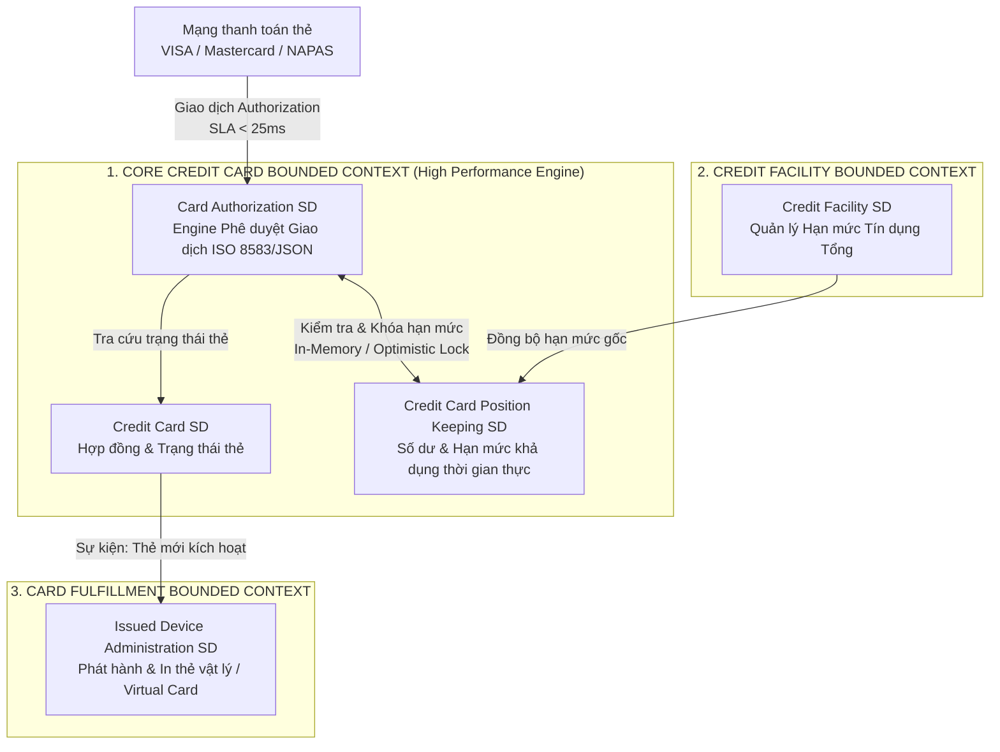
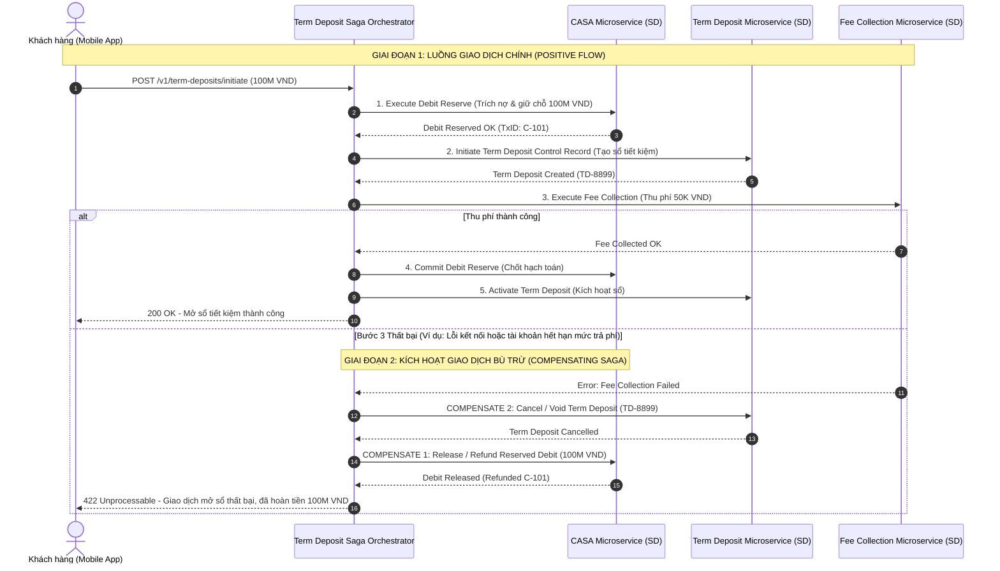

# Chương 15: Bài Tập Thực Chiến Thiết Kế Kiến Trúc & Case Study Tổng Hợp

---

## 1. Giới Thiệu & Mục Tiêu Thực Hành

Nếu "Chương 14" giúp bạn kiểm chứng lý thuyết qua trắc nghiệm, thì "Chương 15" là sân chơi kiến trúc thực chiến (Architectural Workshop). Bạn sẽ đóng vai trò "Enterprise / Lead Solution Architect" của một ngân hàng thương mại quy mô lớn đang triển khai chuyển đổi số.

Chương này bao gồm "4 Bài Tập Lớn (Case Studies)" phản ánh đúng 4 thách thức kinh điển nhất trong mọi dự án hiện đại hóa Core Banking:

1. Bài tập 1: Phân rã Bounded Context & Ánh xạ BIAN Service Domain cho nghiệp vụ Thẻ Tín Dụng.
2. Bài tập 2: Thiết kế Saga Orchestration & Đảm bảo ACID phân tán cho nghiệp vụ Mở Tiết Kiệm Trực Tuyến.
3. Bài tập 3: Thiết kế BIAN Semantic API & Ánh xạ chuẩn thông điệp thanh toán quốc tế ISO 20022 (`pacs.008`).
4. Bài tập 4: Thiết kế kiến trúc chuyển đổi lộ trình Strangler Fig cho hệ thống Core Banking di sản.

Mỗi bài tập đi kèm Đề bài nghiệp vụ chi tiết, "Yêu cầu kết quả cần đạt (Deliverables)" và "Lời giải mẫu chuẩn mực (Reference Solution Architecture)" bao gồm sơ đồ Mermaid và bảng phân tích kỹ thuật.

---

## 2. Bài Tập Lớn 1: Phân Rã Bounded Context & Ánh Xạ BIAN Cho Nghiệp Vụ Thẻ Tín Dụng

### 2.1. Đề Bài & Ngữ Cảnh Nghiệp Vụ
Ngân hàng X muốn xây dựng mới hệ thống "Phát Hành & Quản Trị Thẻ Tín Dụng (Credit Card Issuing & Lifecycle Management Platform)" theo kiến trúc Microservices. Hiện tại, toàn bộ nghiệp vụ từ chấm điểm tín dụng, phát hành thẻ vật lý/thẻ ảo, cấp hạn mức tín dụng thẻ, hạch toán giao dịch quẹt thẻ POS/E-commerce và tính lãi/sao kê thẻ đều nằm chung trong một module liền khối rối rắm.

### 2.2. Yêu Cầu Thực Hiện (Deliverables)
1. Xác định tối thiểu "5 BIAN Service Domains" tương ứng với nghiệp vụ Thẻ Tín Dụng trong BIAN Service Landscape.
2. Gom nhóm các Service Domain này thành các "Bounded Context (Microservices)" hợp lý theo nguyên tắc High Cohesion / Loose Coupling.
3. Vẽ sơ đồ kiến trúc thành phần (Component Diagram) minh họa sự tương tác giữa các dịch vụ.

---

### 2.3. Lời Giải Mẫu Chuẩn Kiến Trúc (Reference Solution)

#### A. Ánh xạ BIAN Service Domains chuẩn mực

| BIAN Service Domain | BIAN Business Domain | Asset / Control Record | Trách nhiệm cốt lõi trong nghiệp vụ Thẻ |
| :--- | :--- | :--- | :--- |
| "Credit Card SD" | Card & Facility | Credit Card Facility | Quản lý hợp đồng thẻ tín dụng, thông số thẻ (PAN, CVV, Expiry), trạng thái thẻ (Active/Blocked). |
| "Card Authorization SD" | Card Authorization | Authorization Record | Xử lý cấp phép giao dịch thanh toán thẻ thời gian thực (hạn mức khả dụng, mã OTP, rủi ro gian lận). |
| "Credit Card Position Keeping SD" | Card Operations | Card Position | Theo dõi dư nợ thẻ thời gian thực, hạn mức tín dụng còn lại (Available Credit Limit), số tiền chờ quyết toán (Pending Hold). |
| "Credit Facility SD" | Credit Management | Credit Facility | Quản lý hạn mức tín dụng tổng thể được phê duyệt của khách hàng. |
| "Issued Device Administration SD" | Card Fulfillment | Issued Device | Quản lý quy trình dập thẻ vật lý, phát hành thẻ ảo (Virtual Card) và giao nhận thẻ. |

#### B. Sơ đồ gom nhóm Bounded Context (Microservices)



> Điểm nhấn kiến trúc: Các Service Domain liên quan đến xử lý giao dịch quẹt thẻ thời gian thực (`Credit Card SD`, `Card Authorization SD`, `Credit Card Position Keeping SD`) được gom vào cùng một "Core Credit Card Bounded Context" với cơ chế lưu trữ bộ nhớ siêu tốc để đảm bảo thời gian phản hồi giao dịch thẻ dưới 25ms, đáp ứng SLA khắt khe của VISA/Mastercard.

---

## 3. Bài Tập Lớn 2: Thiết Kế Saga Orchestration Cho Mở Tiết Kiệm Trực Tuyến

### 3.1. Đề Bài & Ngữ Cảnh Nghiệp Vụ
Khách hàng thực hiện mở một Sổ Tiết Kiệm Trực Tuyến (Online Term Deposit) trị giá "100,000,000 VND" kỳ hạn 12 tháng trên ứng dụng Mobile Banking. Giao dịch này liên quan đến 3 Microservices độc lập với các Database riêng biệt:

1. "Term Deposit Microservice:" Tạo hồ sơ sổ tiết kiệm mới.
2. "CASA Microservice:" Trích nợ 100,000,000 VND từ tài khoản thanh toán của khách hàng.
3. "Fee Calculation & Collection Microservice:" Thu phí dịch vụ mở sổ đặc biệt (ví dụ: 50,000 VND).

### 3.2. Yêu Cầu Thực Hiện (Deliverables)
1. Thiết kế chuỗi giao dịch theo "Saga Orchestration Pattern".
2. Chỉ rõ các bước giao dịch chính (Positive Flow) và luồng hoàn tiền bù trừ ("Compensating Transactions") trong trường hợp bước thu phí hoặc tạo sổ bị lỗi.
3. Vẽ Sequence Diagram đầy đủ minh họa cơ chế phối hợp của Saga Orchestrator.

---

### 3.3. Lời Giải Mẫu Chuẩn Kiến Trúc (Reference Solution)



---

## 4. Bài Tập Lớn 3: Thiết Kế BIAN Semantic API & Ánh Xạ ISO 20022 (`pacs.008`)

### 4.1. Đề Bài & Ngữ Cảnh Nghiệp Vụ
Ngân hàng xây dựng cổng thanh toán liên ngân hàng toàn cầu (Global Cross-Border Payment Gateway). Kênh Mobile Banking gọi đến "Payment Order Microservice" để yêu cầu chuyển tiền ngoại tệ từ Khách hàng A (Ngân hàng X) đến Người thụ hưởng B (Ngân hàng Y tại Singapore).

### 4.2. Yêu Cầu Thực Hiện (Deliverables)
1. Thiết kế hợp đồng API REST chuẩn BIAN Semantic API cho thao tác khởi tạo lệnh thanh toán (`Initiate Payment Order`).
2. Ánh xạ các trường dữ liệu cốt lõi của JSON Payload sang chuẩn thông điệp ISO 20022 `pacs.008.001.08` (Financial Institution To Financial Institution Customer Credit Transfer).

---

### 4.3. Lời Giải Mẫu Chuẩn Kiến Trúc (Reference Solution)

#### A. Đặc tả BIAN Semantic REST API (OpenAPI 3.0 Specification)
- "Endpoint:" `POST /api/v1/payment-orders/initiate`
- "BIAN Action Term:" `Initiate`
- "Control Record:" `PaymentOrder`

```json
{
  "paymentOrderInitiateActionRecord": {
    "paymentOrderReference": "PAY-20260711-998877",
    "paymentOrderType": "CROSS_BORDER_CREDIT_TRANSFER",
    "debtorAccount": {
      "accountIdentification": "001122334455",
      "currency": "USD"
    },
    "creditorAccount": {
      "accountIdentification": "SG99DBS123456789",
      "creditorName": "ALEXANDER WONG",
      "creditorAgentBIC": "DBSSSGSGXXX"
    },
    "instructedAmount": {
      "amount": "15000.00",
      "currency": "USD"
    },
    "remittanceInformation": "Payment for Invoice INV-2026-089"
  }
}
```

#### B. Bảng Ánh Xạ Chuẩn BIAN Semantic API -> ISO 20022 (`pacs.008.001.08`)

| Trường dữ liệu BIAN Semantic API | Trường XML ISO 20022 (`pacs.008`) | Ý nghĩa nghiệp vụ |
| :--- | :--- | :--- |
| `paymentOrderReference` | `<CdtTrfTxInf><PmtId><EndToEndId>` | Mã tham chiếu duy nhất đầu-cuối của giao dịch thanh toán. |
| `debtorAccount.accountIdentification` | `<CdtTrfTxInf><DbtrAcct><Id><Othr><Id>` | Số tài khoản người chuyển tiền (Debtor). |
| `creditorAccount.accountIdentification` | `<CdtTrfTxInf><CdtrAcct><Id><Othr><Id>` | Số tài khoản người thụ hưởng (Creditor). |
| `creditorAccount.creditorAgentBIC` | `<CdtTrfTxInf><CdtrAgt><FinInstnId><BICFI>` | Mã SWIFT BIC của Ngân hàng người thụ hưởng. |
| `instructedAmount.amount` & `currency` | `<CdtTrfTxInf><IntrBkSttlmAmt Ccy="USD">15000.00` | Số tiền và loại tiền tệ quyết toán liên ngân hàng. |
| `remittanceInformation` | `<CdtTrfTxInf><RmtInf><Ustrd>` | Nội dung diễn giải chuyển tiền không cấu trúc/cấu trúc. |

---

## 5. Bài Tập Lớn 4: Lộ Trình Strangler Fig Hiện Đại Hóa Core Tiền Gửi Có Kỳ Hạn

### 5.1. Đề Bài & Ngữ Cảnh Nghiệp Vụ
Ngân hàng hiện đang vận hành Core Banking AS400 liền khối đã 20 năm tuổi. Ban Giám đốc yêu cầu tách riêng phân hệ "Tiền Gửi Có Kỳ Hạn (Term Deposit)" lên cụm Cloud-Native Microservices chuẩn BIAN trong vòng 9 tháng mà không gây gián đoạn dịch vụ cho 5 triệu khách hàng đang giao dịch.

### 5.2. Yêu Cầu Thực Hiện (Deliverables)
1. Vẽ bản vẽ kiến trúc tổng thể áp dụng "Strangler Fig Pattern" kết hợp "Anti-Corruption Layer (ACL)" và "Change Data Capture (CDC Debezium)".
2. Mô tả rõ cơ chế đồng bộ dữ liệu 2 chiều (Coexistence Sync) và điểm chuyển mạch (Routing Switch) tại API Gateway.

---

### 5.3. Lời Giải Mẫu Chuẩn Kiến Trúc (Reference Solution)

```mermaid
flowchart TD
    Customer[Khách hàng / Mobile App / Internet Banking] --> APIGW[Enterprise API Gateway<br>Strangler Routing Switch]

    subgraph LegacyMonolith ["1. DI SẢN MONOLITHIC CORE BANKING (AS400/Oracle)"]
        OldTD[Legacy Term Deposit Module]
        OldCASA[Legacy CASA Module]
        LegacyDB[(Legacy Monolith Database)]
        OldTD --> LegacyDB
        OldCASA --> LegacyDB
    end

    subgraph ModernBIAN ["2. CLOUD-NATIVE BIAN MICROSERVICES"]
        ACL[Anti-Corruption Layer - ACL<br>Chuyển đổi Data Model & Protocol]
        NewTD[BIAN Term Deposit Microservice<br>Service Domain]
        NewTDDB[(Term Deposit Polyglot DB<br>PostgreSQL)]
        NewTD --> NewTDDB
    end

    subgraph EventStreaming ["3. EVENT MESH & DATA SYNCHRONIZATION"]
        CDC[Debezium CDC Engine<br>Đọc Redo Log / Transaction Log]
        Kafka[Enterprise Kafka Event Mesh]
    end

    %% Routing logic
    APIGW -->|80% Giao dịch cũ| OldTD
    APIGW -->|20% Khách hàng mới (Canary Pilot)| NewTD

    %% Synchronization logic
    LegacyDB -->|1. Real-time Log Capture| CDC
    CDC -->|2. Emit Change Event| Kafka
    Kafka -->|3. Consume & Transform| ACL
    ACL -->|4. Sync to Modern DB| NewTDDB

    %% Call back to Legacy CASA when needed
    NewTD -->|5. Trích nợ qua ACL| ACL
    ACL -->|6. Call Legacy CASA API| OldCASA
```

> "Quy trình triển khai lộ trình Strangler Fig 4 giai đoạn:"
> 1. "Giai đoạn chuẩn bị (Khởi tạo CDC & Read-Only Replica):" Sử dụng Debezium CDC đồng bộ dữ liệu sổ tiết kiệm từ `LegacyDB` sang `NewTDDB`. Kênh Digital tra cứu thông tin sổ qua dịch vụ mới (90% tải Read).
> 2. "Giai đoạn Canary Pilot (10% - 20% Write Traffic):" Định tuyến 20% khách hàng mới mở sổ tiết kiệm trực tiếp trên `NewTD Microservice`. Khi cần trích nợ tài khoản CASA (vẫn đang ở Core cũ), dịch vụ mới gọi qua "ACL" để hạch toán an toàn.
> 3. "Giai đoạn chuyển đổi diện rộng (100% Traffic):" Mở rộng 100% lưu lượng mở và tất toán sổ sang BIAN Microservice mới.
> 4. "Giai đoạn cắt bỏ (Decommission):" Ngắt kết nối module Term Deposit cũ trên AS400, hoàn tất bóc tách thành công một domain quan trọng ra khỏi Monolith.

---
*Hoàn thành Chương 14 và Chương 15 đồng nghĩa với việc bạn đã trang bị trọn vẹn cả nền tảng lý thuyết chuẩn mực lẫn kỹ năng thiết kế thực chiến để tự tin dẫn dắt các chương trình chuyển đổi số kiến trúc ngân hàng hiện đại.*
