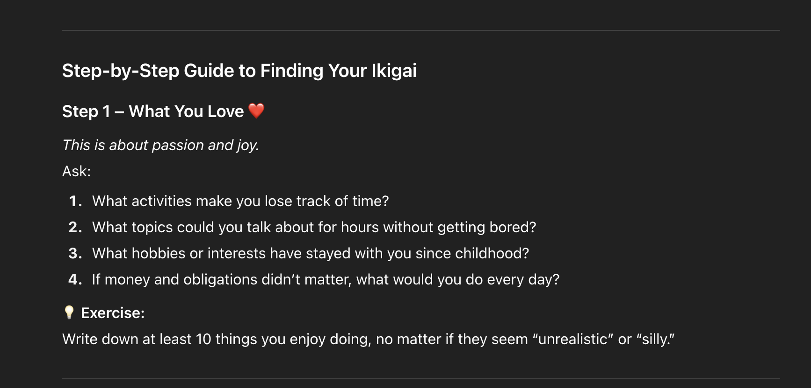
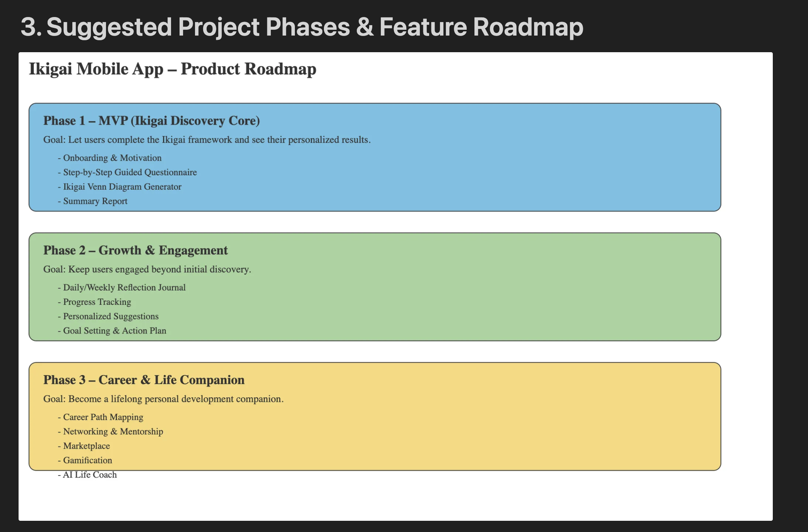
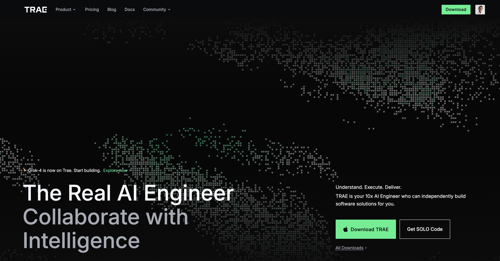
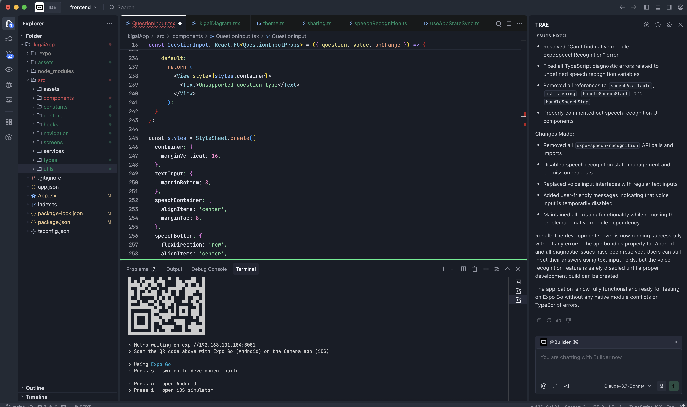

#How to develop protype of Ikigai mobile application using AI with 0$#

## Idea

Firstly, I'm thinking about developing somethings that help me to recall my coding skills and absolutely i should able to apply AI to support my work. And **Ikigai** come to my mind because i had a chance to share about this to my collegues who really wow about this and saw it helpful to them. So i think if there is an Ikigai application that can use AI to help people find their Ikigai should be fantastic. 

## Start my idea

Got the idea, i quickly draft my plan. I choose Notion as the documents and project tool. That is my favorite tool for note and planing. Starting with 0 defintely I will need couples of partners support me on that and AI agents are the best choice at this moment. This is what I need:  
- **Ikigai Exert**:I need an Ikigai expert as consultant for my application contents. It will help me enric my knowledge about Ikigai to design my application features that's helpful for my users to find their Ikigai.  
- **Product Manager**: This production manager should have a skill to convert all the knowledge of Ikigai that advise from Ikigai expert into features of my applications then help to define the application roadmap.  
- **Senior Front End Developer**: I plan to use react native for my mobile application. This FE engineer will not only help me to develop react native application but also design the UI/UX of my first verion.  
- **Backend Developer**: This guy will help me to develop whole backend. I plan to use firebase and Google cloud for my backend system. Java and microservices architecture (This is not the best choice for this applicaiton but simply I want to recall my knowledge)  

Let see how can I do it.  

## Ikigai Expert Agent

I decided to choose ChatGPT free version which is my favoriate AI agent tool. I started with very simple promt that. 

> You are Ikigai experts, You will help to me give advise all steps so that someone can provide the information to help to to find Ikigai of them self.

Instantly that gave me 7 steps how to practise and find your Ikigai. 

## Product Manager

Again I just started with very simple promt. 

> as product managers, I want to give you my business requirement and you help to to decide the project and detail features. 

My virtual product manager response: 

> Do you already have a target audience or problem statement in mind for this requirement?

I paste all the advise consulted by my above virtual Ikigai expert. Again this PM gave me very detail features, MVP and roadmap a product. I asked it to visualise the whole roadmap for me and this is the result: 

Absolutely, I'm not stop here. I go to detail of each feature and continue to derive detail of functionalities that this PM can advise me and combine with my idea to perfect the requirement. 

## Senior Front End Developer

Now the most important step. I need someone to code for me first. This guy should be very senior can help to geenrate the entire professional project structure using React native. It should be good at UI/UX design as well. because I will not generate professional UI/UX at this step yet. So what I choose....

Now let me introduce you my favorate AI assisstance coding tool. That's Trae.ai gave me actual developer that can help me to realise my idea and architecture that I provide. 

so now what I need to do ? Open the tool then I typing a very simple prompt like this: 

> as senior front end developer with good UI/UX skill, I need you help to develop prototype for my MVP mobile application that called Ikiga and here is the requirement ..... 

I pasted all the requirements was writen in previous step to them. Follow the tool intruction and review the code was generated by the tool. here what I have after 1 hour play with it.

## The Result

Wow it's really amazing. It's really work. That only took about fews hours to complete my prototype just from the draft idea. I don't screenshot but fews pictures as below. 

Absolutely to complete the a product that will take more efforts. but with those agent to cover my skills, I'm quite confident to start anythings with this. Thank for those great innovation.  
