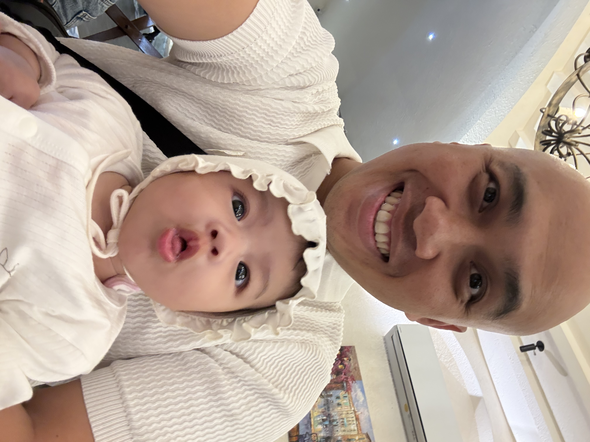

# About Me

  

Xin chào! Mình là Lương.

Bên ngoài công việc, mình đơn giản là bố của một cô công chúa nhỏ. Với mình, gia đình luôn là niềm tự hào và là bến đỗ bình yên nhất. Khi rảnh rỗi, mình thích chìm đắm vào việc chơi game, gõ lạch cạch vài dòng viết lách linh tinh và luôn giữ sự tò mò mạnh mẽ với các xu hướng công nghệ mới.

Trong công việc, mình có hơn 15 năm lăn lộn trong ngành phần mềm. Gắn bó với mảng miếng kiến trúc phần mềm (software architecture), mình dành nhiều thời gian và tâm huyết để giúp các hệ thống lớn, cũ kỹ "lột xác" qua quá trình hiện đại hoá (system modernization). 

Góc nhỏ này là nơi mình lưu giữ và chia sẻ lại những hành trình mộc mạc đó—về cả đời thường lẫn những đam mê công nghệ. Rất vui vì bạn đã rẽ ngang đọc vài dòng chia sẻ này!

